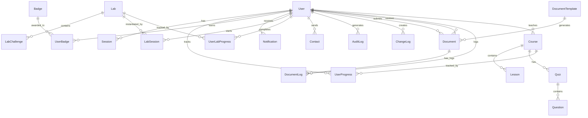

<div dir="rtl" lang="ar">

# 🛡️ أكاديمية الدرع السيبراني — CyberShield Academy
## التوثيق التقني الاحترافي الشامل

---

**إصدار المستند:** 3.0  
**تاريخ الإصدار:** مايو 2026  
**مستوى السرية:** عام — للأغراض الأكاديمية والتقنية  
**عدد الصفحات التقديري:** +100 صفحة  

---

# فهرس المحتويات

| القسم | العنوان |
|--------|---------|
| 1 | الملخص التنفيذي |
| 2 | المقدمة |
| 3 | أهداف المشروع |
| 4 | الدراسات السابقة والمنصات المشابهة |
| 5 | تحليل المشكلة |
| 6 | الحل المقترح |
| 7 | ميزات المنصة |
| 8 | بنية النظام (System Architecture) |
| 9 | التقنيات المستخدمة |
| 10 | تصميم قاعدة البيانات |
| 11 | أدوار المستخدمين والصلاحيات |
| 12 | تصميم واجهة برمجة التطبيقات (API) |
| 13 | واجهة المستخدم (UI/UX) |
| 14 | الأمان والحماية |
| 15 | الاختبارات والأداء |
| 16 | المشكلات الشائعة والحلول |
| 17 | الأدوات وبيئة العمل |
| 18 | النتائج والتحليلات |
| 19 | خطة التطوير المستقبلية |
| 20 | التوصيات والخاتمة |

---

# القسم الأول: الملخص التنفيذي (Executive Summary)

## 1.1 نظرة عامة على المنصة

أكاديمية الدرع السيبراني (CyberShield Academy) هي منصة تعليمية متكاملة ومتقدمة متخصصة في مجال الأمن السيبراني، صُممت لتكون النظام البيئي الشامل (Ecosystem) الذي يجمع بين التعليم النظري والتطبيق العملي في بيئة واحدة آمنة وتفاعلية. تهدف المنصة إلى سد الفجوة الحرجة بين المعرفة الأكاديمية والمهارات العملية المطلوبة في سوق العمل، مع التركيز على تقديم محتوى عربي احترافي عالي الجودة.

تقدم المنصة مجموعة شاملة من الخدمات تتضمن:
- **نظام دورات تدريبية متكامل** يشمل أكثر من 50 دورة تغطي 12 تخصصاً في الأمن السيبراني
- **مختبرات عملية معزولة** تعتمد على تقنية Docker لتوفير بيئات اختراق آمنة
- **محرك تحديات CTF (Capture The Flag)** مع نظام ذكي للتحقق من الأعلام ومقاومة الغش
- **مساعد ذكاء اصطناعي محلي** مبني على نموذج DeepSeek-R1 يعمل بدون اتصال سحابي
- **خريطة هجمات سيبرانية حية** تعرض التهديدات في الوقت الفعلي عبر WebSocket
- **نظام شهادات رقمية** مع توقيعات SHA-256 لضمان المصداقية
- **لوحات تحكم ذكية** للمستخدمين والمدربين والمسؤولين
- **محرك توصيات ذكي** يحلل أنماط التعلم ويقدم مسارات مخصصة
- **نظام اشتراكات ودفع إلكتروني** متكامل مع Stripe

## 1.2 الرؤية والرسالة

### الرؤية
أن تصبح أكاديمية الدرع السيبراني المنصة العربية الرائدة والأولى في تعليم الأمن السيبراني على مستوى الشرق الأوسط وشمال أفريقيا، وأن تكون المرجع الأساسي لكل متعلم ومحترف يسعى لبناء مسيرته المهنية في هذا المجال الحيوي.

### الرسالة
تمكين الأفراد والمؤسسات من بناء قدرات أمن سيبراني متقدمة من خلال منصة تعليمية شاملة تجمع بين المحتوى النظري الأكاديمي والتدريب العملي التفاعلي، مدعومة بتقنيات الذكاء الاصطناعي وأحدث أساليب التعليم الإلكتروني.

## 1.3 الجمهور المستهدف

| الفئة | الوصف | الاحتياجات |
|-------|-------|------------|
| **الطلاب الجامعيون** | طلاب تخصصات الحاسب وأمن المعلومات | محتوى أكاديمي + تطبيق عملي + شهادات |
| **المحترفون المبتدئون** | الراغبون في دخول مجال الأمن السيبراني | مسارات تعلم منظمة + مختبرات تدريبية |
| **خبراء الأمن** | محترفون يريدون تطوير مهاراتهم | تحديات CTF متقدمة + محتوى متخصص |
| **المؤسسات والشركات** | فرق IT وأمن المعلومات | تدريب جماعي + تقارير + لوحات تحكم إدارية |
| **الباحثون الأكاديميون** | باحثون في مجال أمن المعلومات | أدوات بحثية + قاموس مصطلحات + مراجع |

## 1.4 القيمة المضافة (Value Proposition)

1. **أول منصة عربية شاملة**: تجمع بين التعليم والتطبيق والشهادات في مكان واحد
2. **ذكاء اصطناعي محلي**: مساعد ذكي يعمل بدون إرسال بيانات للسحابة (خصوصية تامة)
3. **مختبرات معزولة بالحاويات**: كل مستخدم يحصل على بيئة Docker خاصة ومعزولة تماماً
4. **نظام مقاومة الغش المتقدم**: تحليل زمني وارتباط IP ومراقبة أنماط الحل
5. **متوافق مع معايير GDPR**: حق الوصول والحذف ونقل البيانات مدمج في المنصة
6. **متوافق مع NCA-ECC و ISO 27001**: خدمة امتثال مدمجة للمعايير الدولية والمحلية

---

# القسم الثاني: المقدمة (Introduction)

## 2.1 ما هو المشروع؟

أكاديمية الدرع السيبراني هي منصة ويب تفاعلية من الجيل التالي مبنية على إطار عمل Next.js 16 مع معمارية Full-Stack حديثة. تتميز المنصة بكونها أكثر من مجرد نظام إدارة تعلم (LMS) تقليدي — فهي نظام بيئي متكامل (Ecosystem) يشمل:

- **بوابة تعليمية (Learning Portal):** دورات فيديو تفاعلية مع تتبع تقدم دقيق على مستوى الدرس
- **مختبر سيبراني (Cyber Range):** بيئات اختراق معزولة تعتمد على Docker مع حدود موارد (CPU/RAM) وانتهاء زمني تلقائي
- **ساحة تحديات (CTF Arena):** محرك CTF متقدم مع تحقق ذكي من الأعلام، يدعم صيغ متعددة ويقدم تلميحات تعليمية
- **مركز ذكاء (AI Hub):** مساعد ذكي محلي مبني على نموذج DeepSeek-R1-Distill-Qwen-1.5B يعمل دون اتصال بالإنترنت
- **مرصد تهديدات (Threat Observatory):** خريطة هجمات حية تعتمد على WebSocket لعرض الهجمات في الوقت الفعلي
- **مركز عمليات أمنية (SOC Dashboard):** لوحات مراقبة وسجلات تدقيق وجدار حماية وإدارة ثغرات
- **نظام إدارة مستندات (DMS):** دورة حياة وثائق كاملة مع قوالب وتوقيعات رقمية

## 2.2 أهمية الأمن السيبراني

يُعد الأمن السيبراني من أهم التحديات التي تواجه العالم في القرن الحادي والعشرين. مع التحول الرقمي المتسارع وانتشار تقنيات إنترنت الأشياء (IoT) والحوسبة السحابية والذكاء الاصطناعي، تتزايد التهديدات السيبرانية بشكل غير مسبوق:

### إحصائيات عالمية مقلقة:
- **10.5 تريليون دولار**: التكلفة السنوية المتوقعة للجرائم السيبرانية بحلول 2025
- **3.5 مليون وظيفة شاغرة**: نقص حاد في الكوادر المتخصصة عالمياً
- **300% زيادة**: في هجمات الفدية (Ransomware) خلال السنوات الخمس الأخيرة
- **95% من الاختراقات**: ناجمة عن أخطاء بشرية يمكن تجنبها بالتدريب المناسب
- **هجمة كل 39 ثانية**: معدل الهجمات السيبرانية على مستوى العالم

### الوضع في المنطقة العربية:
- تعاني المنطقة العربية من نقص حاد في المحتوى التعليمي المتخصص باللغة العربية
- معظم المنصات التدريبية متوفرة باللغة الإنجليزية فقط، مما يُشكل حاجزاً أمام شريحة كبيرة من المتعلمين
- هيئات مثل الهيئة الوطنية للأمن السيبراني (NCA) في المملكة العربية السعودية تفرض معايير مثل ECC تتطلب كوادر مؤهلة
- الطلب المتزايد على محترفي الأمن السيبراني في دول الخليج والمنطقة يفوق العرض بكثير

## 2.3 لماذا هذه المنصة مطلوبة؟

### الفجوات الحالية في السوق:
1. **فجوة اللغة**: ندرة المحتوى العربي الاحترافي في الأمن السيبراني
2. **فجوة التطبيق**: معظم المنصات تركز على النظرية دون التطبيق العملي
3. **فجوة التكامل**: الحاجة للتنقل بين عدة منصات (دورات + مختبرات + تحديات)
4. **فجوة التخصيص**: غياب مسارات تعلم مخصصة تتكيف مع مستوى المتعلم
5. **فجوة الخصوصية**: معظم المساعدات الذكية تعتمد على السحابة (مخاوف خصوصية)

## 2.4 بيان المشكلة (Problem Statement)

> **كيف يمكن تصميم وتطوير منصة تعليمية عربية شاملة ومتكاملة في مجال الأمن السيبراني تجمع بين التعليم النظري التفاعلي والتدريب العملي المعزول، مدعومة بالذكاء الاصطناعي ونظام ألعاب تحفيزي (Gamification)، مع ضمان أعلى معايير الأمان والخصوصية وقابلية التوسع على مستوى المؤسسات؟**

---

# القسم الثالث: أهداف المشروع (Project Objectives)

## 3.1 الأهداف الرئيسية

1. **بناء منصة تعليمية متكاملة**: تطوير نظام بيئي شامل يغطي جميع جوانب تعليم الأمن السيبراني من المستوى المبتدئ إلى الخبير
2. **توفير بيئة تدريب عملي آمنة**: تصميم مختبرات سيبرانية معزولة باستخدام تقنية الحاويات (Docker) مع إدارة موارد ذكية
3. **دمج الذكاء الاصطناعي**: تطوير مساعد ذكي محلي يعمل دون اتصال سحابي لضمان الخصوصية
4. **تطبيق أعلى معايير الأمان**: بناء بنية أمنية متعددة الطبقات تشمل التشفير والجدار الناري ومقاومة الغش
5. **دعم التعلم المخصص**: تطوير محرك توصيات ذكي يحلل أنماط التعلم ويقترح مسارات مخصصة

## 3.2 الأهداف الفرعية

### أهداف تقنية:
- تطوير واجهة برمجة تطبيقات RESTful شاملة تضم أكثر من 36 مجموعة نقاط نهاية (Endpoint)
- بناء نظام مصادقة متعدد الطبقات (JWT + 2FA + Session Management)
- تنفيذ نظام تحكم بالوصول المبني على الأدوار (RBAC) مع ثلاثة مستويات: مستخدم، مدرب، مسؤول
- تصميم قاعدة بيانات SQLite محسّنة مع أكثر من 30 جدولاً/نموذجاً
- بناء نظام Middleware أمني شامل يتضمن Rate Limiting و Honeypot و WAF

### أهداف تعليمية:
- إنشاء قاموس يضم أكثر من 1,300 مصطلح سيبراني بالعربية والإنجليزية
- تصميم 12 مسار تعلم متخصص يغطي جميع تخصصات الأمن السيبراني
- تطوير نظام شهادات رقمية مع توقيعات تشفيرية

### أهداف أمنية:
- التوافق مع معايير OWASP Top 10 في جميع نقاط الـ API
- تنفيذ التوافق مع GDPR (حق الوصول، الحذف، نقل البيانات)
- بناء نظام تدقيق شامل (Audit Logging) يسجل جميع العمليات الحساسة

## 3.3 النتائج المتوقعة

| المخرج | الوصف | مؤشر النجاح |
|--------|-------|-------------|
| منصة ويب كاملة | تطبيق Next.js 16 جاهز للإنتاج | بناء ناجح + نشر Docker |
| نظام دورات | CRUD كامل مع تتبع تقدم | +50 دورة + فيديوهات + اختبارات |
| مختبرات عملية | بيئات Docker معزولة | 6 أنواع مختبرات + إدارة جلسات |
| محرك CTF | نظام تحديات مع تحقق ذكي | تحقق مرن + مقاومة غش |
| مساعد AI | نموذج DeepSeek محلي | استجابة < 5 ثوانٍ |
| لوحات تحكم | 3 لوحات (مستخدم/مدرب/مسؤول) | إحصائيات + رسوم بيانية |
| نظام أمني | حماية متعددة الطبقات | 0 ثغرات حرجة |

---

# القسم الرابع: الدراسات السابقة والمنصات المشابهة (Related Work)

## 4.1 تحليل المنصات المنافسة

### 4.1.1 TryHackMe
- **الوصف**: منصة تعليمية تفاعلية للأمن السيبراني
- **نقاط القوة**: مختبرات عملية ممتازة، مسارات تعلم منظمة، مجتمع نشط
- **نقاط الضعف**: محتوى إنجليزي فقط، تكلفة اشتراك مرتفعة، لا يوجد مساعد AI
- **التسعير**: $14/شهر للباقة المدفوعة

### 4.1.2 Hack The Box
- **الوصف**: منصة تحديات اختراق للمحترفين
- **نقاط القوة**: تحديات متقدمة جداً، بيئات واقعية، شهادات معترف بها (CPTS)
- **نقاط الضعف**: منحنى تعلم حاد، غير مناسب للمبتدئين، لا دعم عربي
- **التسعير**: $18/شهر

### 4.1.3 Cybrary
- **الوصف**: منصة تعليم أمن سيبراني مع دورات فيديو
- **نقاط القوة**: مكتبة دورات ضخمة، مسارات مهنية واضحة
- **نقاط الضعف**: تطبيق عملي محدود، واجهة قديمة، لا مختبرات تفاعلية
- **التسعير**: مجاني جزئياً + $59/شهر

### 4.1.4 PentesterLab
- **الوصف**: منصة متخصصة في اختبار الاختراق
- **نقاط القوة**: محتوى تقني عميق، تمارين عملية
- **نقاط الضعف**: نطاق محدود (اختبار اختراق فقط)، واجهة بسيطة
- **التسعير**: $20/شهر

### 4.1.5 RangeForce
- **الوصف**: منصة تدريب مؤسسية للأمن السيبراني
- **نقاط القوة**: تدريب مؤسسي متقدم، محاكاة واقعية
- **نقاط الضعف**: موجهة للمؤسسات فقط، تكلفة عالية جداً
- **التسعير**: تسعير مؤسسي خاص

## 4.2 جدول المقارنة الشامل

| الميزة | CyberShield | TryHackMe | HTB | Cybrary | PentesterLab |
|--------|-------------|-----------|-----|---------|--------------|
| محتوى عربي | ✅ كامل | ❌ | ❌ | ❌ | ❌ |
| دورات فيديو | ✅ | ✅ | ✅ | ✅ | ⚠️ محدود |
| مختبرات Docker | ✅ | ✅ | ✅ | ❌ | ✅ |
| تحديات CTF | ✅ | ✅ | ✅ | ❌ | ⚠️ محدود |
| مساعد AI | ✅ محلي | ❌ | ❌ | ❌ | ❌ |
| نظام Gamification | ✅ متقدم | ✅ | ✅ | ⚠️ بسيط | ❌ |
| خريطة تهديدات | ✅ حية | ❌ | ❌ | ❌ | ❌ |
| شهادات رقمية | ✅ | ⚠️ | ✅ | ✅ | ❌ |
| GDPR متوافق | ✅ | ✅ | ✅ | ✅ | ⚠️ |
| Anti-Cheat | ✅ متقدم | ⚠️ بسيط | ✅ | — | ❌ |
| نظام فرق | ✅ | ✅ | ✅ | ❌ | ❌ |
| مطابقة وظائف | ✅ | ❌ | ❌ | ✅ | ❌ |
| الباقة المجانية | ✅ | ✅ | ⚠️ محدود جداً | ✅ | ❌ |

## 4.3 الفجوات المحددة

1. **غياب المحتوى العربي**: لا توجد منصة منافسة تقدم محتوى عربي شامل
2. **عدم التكامل**: المنصات الحالية تتطلب التنقل بين أدوات متعددة
3. **الذكاء الاصطناعي**: لا توجد منصة تدمج مساعد AI محلي يحترم الخصوصية
4. **التخصيص**: محركات التوصية الذكية غائبة في معظم المنصات
5. **الامتثال المحلي**: لا توجد منصة تدعم معايير NCA-ECC السعودية

</div>

<div dir="rtl" lang="ar">

# القسم الخامس: تحليل المشكلة (Problem Analysis)

## 5.1 المشكلات الحالية في تعليم الأمن السيبراني

### 5.1.1 الفجوة التعليمية اللغوية
المشكلة الأبرز التي تواجه المتعلم العربي هي ندرة المحتوى المتخصص باللغة العربية. معظم الدورات والشهادات المعترف بها (CompTIA Security+, CEH, OSCP) متوفرة بالإنجليزية حصرياً. هذا يُشكل:
- **حاجز الدخول**: كثير من المتعلمين يمتلكون القدرات التقنية لكن يعجزون عن استيعاب المحتوى الإنجليزي المتقدم
- **فقدان الدقة**: الترجمة الحرفية للمفاهيم التقنية تؤدي لسوء فهم خطير في مجال حساس كالأمن
- **محدودية المراجع**: عدم وجود قاموس مصطلحات شامل بالعربية يُصعّب البحث والدراسة المستقلة

### 5.1.2 الفجوة بين النظرية والتطبيق
- **70% من خريجي تخصصات الأمن السيبراني** يفتقرون للمهارات العملية المطلوبة في سوق العمل
- بيئات التدريب العملية مكلفة ومعقدة الإعداد وتتطلب بنية تحتية خاصة
- المختبرات الجامعية غالباً محدودة الموارد ولا تُحاكي السيناريوهات الواقعية
- غياب بيئات آمنة لممارسة الاختراق الأخلاقي بشكل قانوني

### 5.1.3 الفجوة التقنية في المنصات الحالية
- **غياب العزل الأمني**: بعض المنصات لا توفر بيئات معزولة تماماً لكل مستخدم
- **عدم وجود نظام ذكي لمقاومة الغش**: تسريب الأعلام (Flags) والحلول مشكلة شائعة في منصات CTF
- **محدودية التخصيص**: المنصات الحالية تقدم مسارات ثابتة لا تتكيف مع المتعلم
- **مخاوف الخصوصية**: المساعدات الذكية ترسل البيانات لخوادم سحابية خارجية

### 5.1.4 الفجوة المؤسسية
- عدم وجود أدوات لتتبع تقدم الموظفين في التدريب الأمني
- غياب التوافق مع معايير الامتثال المحلية (NCA-ECC) والدولية (ISO 27001)
- صعوبة إدارة الاشتراكات المؤسسية وتقارير الأداء الجماعية

## 5.2 نقاط الألم لدى المستخدمين (User Pain Points)

| نقطة الألم | الفئة المتأثرة | مستوى الأولوية |
|------------|-----------------|----------------|
| لا أجد محتوى عربي شامل ومتخصص | جميع المتعلمين | 🔴 حرج |
| أحتاج بيئة عملية آمنة للتدريب | الطلاب والمحترفون | 🔴 حرج |
| لا أعرف من أين أبدأ | المبتدئون | 🟡 مرتفع |
| أحتاج مساعدة فورية أثناء التعلم | جميع المتعلمين | 🟡 مرتفع |
| لا أجد ربط بين التعلم والوظائف | الباحثون عن عمل | 🟠 متوسط |
| صعوبة تتبع تقدم فريق العمل | المؤسسات | 🟠 متوسط |
| لا أثق بأمان بياناتي على المنصة | جميع المستخدمين | 🟡 مرتفع |

---

# القسم السادس: الحل المقترح (Proposed Solution)

## 6.1 كيف تحل المنصة المشكلة

أكاديمية الدرع السيبراني تعالج كل فجوة محددة في القسم السابق من خلال حلول تقنية مبتكرة:

### معالجة الفجوة اللغوية:
- **نظام ثنائي اللغة (Bilingual)**: جميع المحتويات متوفرة بالعربية والإنجليزية (حقول `titleAr`/`titleEn`، `descAr`/`descEn`)
- **قاموس مصطلحات شامل**: أكثر من 1,300 مصطلح مع التعريف والمثال بكلتا اللغتين
- **واجهة RTL أصلية**: تصميم واجهة المستخدم أصلياً من اليمين لليسار

### معالجة فجوة التطبيق العملي:
- **Lab Manager بالحاويات**: محرك `lab-manager.ts` يدير حاويات Docker معزولة لكل مستخدم
- **6 أنواع مختبرات**: Web Vulnerabilities, Network Scanning, Linux PrivEsc, Cryptography, Forensics, WiFi Hacking
- **حدود موارد**: كل حاوية محدودة بـ 512MB RAM و 0.5 CPU
- **انتهاء تلقائي**: الجلسات تنتهي تلقائياً بعد ساعتين مع تنظيف دوري كل 5 دقائق

### معالجة فجوة التخصيص:
- **Recommendation Engine**: محرك توصيات ثلاثي الاستراتيجيات (Content-Based + Collaborative + Skill Progression)
- **Skill Profile Engine**: بناء ملف مهارات ديناميكي من أنشطة المستخدم (دورات + مختبرات + CTF)
- **Career Matching**: مطابقة ذكية بين مهارات المستخدم والوظائف المتاحة

### معالجة مخاوف الخصوصية:
- **AI محلي**: نموذج DeepSeek-R1 يعمل على الخادم المحلي — لا بيانات تُرسل للسحابة
- **تشفير AES-256-GCM**: تشفير الحقول الحساسة في قاعدة البيانات
- **GDPR مدمج**: وحدة `gdpr.ts` تنفذ حق الوصول والحذف والنقل

## 6.2 الابتكارات الرئيسية

### 1. محرك التحقق الذكي من الأعلام (Smart Flag Verification)
```
المستخدم يُدخل: "  CyberShield{sql_injection_found}  "
↓ normalizeFlag() → تنظيف المسافات والأحرف المخفية
↓ validateInput() → فحص XSS/SQLi
↓ compareFlags() → مقارنة ذكية غير حساسة لحالة الأحرف
↓ extractFlagContent() → تحليل بنية الفلاق
→ النتيجة: ✅ صحيح + تلميحات تعليمية في حالة الخطأ
```

### 2. نظام مقاومة الغش متعدد الطبقات (Anti-Cheat System)
- **الطبقة 1**: Rate Limiting — حد 10 محاولات لكل تحدي كل 5 دقائق
- **الطبقة 2**: Timing Analysis — كشف الحل السريع المريب (3 حلول في < 30 ثانية)
- **الطبقة 3**: IP Correlation — كشف حسابات متعددة من نفس IP
- **الطبقة 4**: Injection Detection — منع حقن أكواد ضارة في حقل الإدخال
- **الطبقة 5**: Lab Integrity — التحقق من بدء المختبر فعلياً قبل قبول الحل

### 3. نظام الألعاب التحفيزي المتقدم (Advanced Gamification)
- **8 مستويات خبرة**: Script Kiddie → Noob → Beginner → Intermediate → Advanced → Expert → Elite → Legend
- **16 إنجازاً**: شملت إنجازات المعالم والحجم والاستمرارية والنقاط والصعوبة
- **XP تلقائي**: النقاط تُمنح تلقائياً عند تحقيق الشروط

## 6.3 الميزات التنافسية

1. **المنصة الوحيدة** التي تقدم AI محلي يعمل بدون سحابة
2. **نظام Anti-Cheat خماسي الطبقات** غير موجود في أي منافس
3. **متوافقة مع NCA-ECC** — أول منصة تعليمية تدعم المعايير السعودية
4. **نظام DMS مدمج** — إدارة مستندات احترافية بقوالب وتوقيعات رقمية
5. **محرك مطابقة وظائف** — ربط مباشر بين المهارات المكتسبة وسوق العمل

---

# القسم السابع: ميزات المنصة (Platform Features)

## 7.1 نظام الدورات التدريبية (Courses System)

### البنية:
```
Course (دورة)
├── Lessons[] (الدروس)
│   ├── titleAr / titleEn
│   ├── videoUrl (رابط الفيديو)
│   ├── duration (المدة)
│   └── order (الترتيب)
├── Quizzes[] (الاختبارات)
│   └── Questions[] (الأسئلة)
│       ├── questionText
│       ├── options (JSON)
│       ├── correctAnswer
│       └── points (النقاط)
└── UserProgress (تقدم المستخدم)
    ├── progress (0-100%)
    └── completed (boolean)
```

### الميزات التفصيلية:
- **دعم ثنائي اللغة**: كل دورة تحتوي على عنوان ووصف بالعربية والإنجليزية
- **مستويات متعددة**: مبتدئ، متوسط، متقدم
- **نظام دروس مرتب**: دروس مرقمة بالتسلسل مع دعم فيديو
- **اختبارات تفاعلية**: أسئلة متعددة الخيارات مع نقاط لكل سؤال
- **تتبع التقدم**: نسبة إتمام دقيقة لكل مستخدم في كل دورة
- **ربط بالمدرب**: كل دورة مرتبطة بمدرب مع إمكانية التواصل
- **نظام تسعير مرن**: دورات مجانية ومدفوعة مع خصومات الباقات

## 7.2 نظام المختبرات العملية (Labs System)

### تقنية الحاويات:
يعتمد نظام المختبرات على معمارية Docker لتوفير بيئات معزولة:

| مختبر | الصورة | المنافذ | الأعلام |
|-------|--------|---------|---------|
| Web Vulnerabilities | `cybershield/lab-web-vuln` | 80, 443 | SQL Injection, XSS, Admin Access |
| Network Scanning | `cybershield/lab-network` | 21,22,80,445,3306 | Open Ports, FTP Anon, SMB Share |
| Linux PrivEsc | `cybershield/lab-linux-privesc` | 22 | User Shell, Root Flag |
| Cryptography | `cybershield/lab-crypto` | 8080 | Caesar Decoded, RSA Cracked |
| Forensics | `cybershield/lab-forensics` | 80 | Hidden File, Deleted Data |
| WiFi WPA2 | `cybershield/lab-wifi` | 80, 8080 | Handshake, Password |

### إدارة الجلسات:
- **حد التزامن**: حد أقصى 2 مختبر متزامن لكل مستخدم
- **IP ديناميكي**: كل جلسة تحصل على عنوان IP فريد في نطاق 10.x.x.x
- **منفذ عشوائي**: منفذ فريد في نطاق 10000-60000
- **انتهاء تلقائي**: ساعتان كحد أقصى مع تنظيف كل 5 دقائق
- **تسجيل شامل**: كل بدء/إيقاف يُسجل في سجل التدقيق

## 7.3 نظام تحديات CTF

### محرك التحقق من الأعلام:
يتميز محرك CTF بنظام تحقق ذكي متعدد الخطوات:

1. **التنظيف (Normalization)**: إزالة المسافات، الأحرف المخفية (Zero-Width Space)، تحويل Non-Breaking Space
2. **الفحص الأمني (Validation)**: كشف أنماط XSS و SQL Injection في الإدخال
3. **التحليل البنيوي (Parsing)**: التعرف على بادئة `CyberShield{...}` واستخراج المحتوى
4. **المقارنة الذكية (Smart Compare)**: مقارنة غير حساسة لحالة الأحرف مع تلميحات تعليمية

### أمثلة على التلميحات الذكية:
- إذا أدخل المستخدم المحتوى بدون الغلاف: *"تأكد من كتابة الفلاق بالصيغة: CyberShield{...}"*
- إذا كان الغلاف صحيحاً لكن المحتوى خاطئ: *"الصيغة صحيحة لكن محتوى الفلاق غير صحيح"*
- إذا وُجدت مسافات زائدة: *"تأكد من عدم وجود مسافات زائدة"*

## 7.4 المساعد الذكي (AI Assistant)

### المواصفات التقنية:
- **النموذج**: DeepSeek-R1-Distill-Qwen-1.5B-Q4_0.gguf
- **المكتبة**: node-llama-cpp v3.18.1
- **الوضع**: محلي بالكامل (No Cloud)
- **System Prompt**: مخصص كخبير أمن سيبراني عربي باسم "درع"

### السياقات المدعومة:
```typescript
type AIContext = 'general' | 'lesson' | 'lab' | 'ctf' | 'attack-map';
```
- **عام**: أسئلة عامة عن الأمن السيبراني
- **درس**: مساعدة سياقية أثناء مشاهدة الدروس
- **مختبر**: إرشادات عملية أثناء العمل في المختبرات
- **CTF**: تلميحات ذكية دون كشف الحل
- **خريطة الهجمات**: شرح أنواع الهجمات المعروضة

### مكون الواجهة (AIChatWidget):
- واجهة محادثة تفاعلية بحجم 30,970 بايت
- دعم Markdown في الردود
- حفظ سجل المحادثة
- مؤشر كتابة حي

## 7.5 خريطة الهجمات السيبرانية (Attack Map)

### التقنية:
- اتصال WebSocket مباشر عبر خادم Express مستقل (المنفذ 3001)
- تحديث في الوقت الفعلي لبيانات الهجمات
- مكون `ThreatMapPreview.tsx` بحجم 5,886 بايت للعرض المرئي

### البيانات المعروضة:
- نوع الهجمة (DDoS, Malware, Phishing, Brute Force, إلخ)
- مصدر الهجمة (الدولة/المدينة)
- الهدف
- الشدة (Critical, High, Medium, Low)
- الطابع الزمني

## 7.6 نظام الشهادات (Certification System)

### مراحل الشهادة:
1. **إتمام الدورة**: الوصول لنسبة تقدم 100%
2. **اجتياز الاختبار**: تحقيق الحد الأدنى في اختبار الدورة
3. **إصدار الشهادة**: توليد شهادة رقمية بتوقيع SHA-256
4. **التحقق**: رمز تحقق فريد يمكن مسحه ضوئياً

### بيانات الشهادة:
- اسم الطالب والدورة
- تاريخ الإصدار
- الرقم التسلسلي الفريد
- توقيع SHA-256 (Hash of submitterId + templateCode + data + timestamp)

## 7.7 لوحات التحكم (Dashboards)

### لوحة المستخدم:
- تقدم الدورات مع أشرطة تقدم مرئية
- إحصائيات النقاط والمستوى
- الشارات والإنجازات المحققة
- التحديات المحلولة والمعلقة
- توصيات الدورات والمختبرات المخصصة
- ملف المهارات التفاعلي (Radar Chart)

### لوحة المدرب:
- إدارة الدورات والدروس
- متابعة تقدم الطلاب
- جدولة جلسات Google Meet
- إحصائيات التفاعل والأداء

### لوحة المسؤول:
- إحصائيات المنصة الشاملة (مستخدمون، دورات، إيرادات)
- سجلات التدقيق والأمان
- إدارة المستخدمين والصلاحيات
- جدار الحماية وقوائم الحظر
- لوحة الامتثال (NCA-ECC / ISO 27001)
- إدارة الأصول والثغرات
- سجل التغييرات مع الموافقات
- نظام إدارة المستندات (DMS)

</div>

<div dir="rtl" lang="ar">

# القسم الثامن: بنية النظام (System Architecture)

## 8.1 المعمارية عالية المستوى (High-Level Architecture)

```mermaid
graph TB
    subgraph Client["🌐 العميل (Browser)"]
        UI[React 19 UI]
        WS[WebSocket Client]
    end

    subgraph NextJS["âš¡ Next.js 16 Server"]
        MW[Middleware Layer<br/>Rate Limit + WAF + CORS + Security Headers]
        API[API Routes Layer<br/>36+ Endpoint Groups]
        SSR[Server-Side Rendering]
        GUARD[API Guard<br/>Auth + RBAC + Firewall + Validation]
    end

    subgraph Services["🔧 Core Services"]
        AI[AI Engine<br/>DeepSeek R1 Local]
        LAB[Lab Manager<br/>Docker Orchestrator]
        GAME[Gamification Engine<br/>XP + Achievements]
        REC[Recommendation Engine<br/>Smart Suggestions]
        SKILL[Skill Profile Engine<br/>Career Matching]
        ANTI[Anti-Cheat System<br/>5-Layer Protection]
        MAIL[Mailer Service<br/>Nodemailer SMTP]
        GDPR_S[GDPR Service<br/>Export + Erasure]
        COMP[Compliance Service<br/>NCA-ECC + ISO 27001]
    end

    subgraph Security["🛡️ Security Layer"]
        DP[Data Protection<br/>AES-256-GCM + HMAC]
        FW[Firewall Service<br/>IP Block/Allow]
        IDS[IDS Service<br/>Intrusion Detection]
        LOG[Logger<br/>Structured DB Logging]
        AUDIT[Audit System<br/>Full Action Trail]
    end

    subgraph Data["💾 Data Layer"]
        SQLite[(SQLite Database<br/>better-sqlite3)]
        Prisma[Prisma ORM<br/>30+ Models]
        Cache[In-Memory Cache<br/>LRU Strategy]
    end

    subgraph External["☁️ External Services"]
        Stripe[Stripe<br/>Payments]
        SMTP[SMTP Server<br/>Gmail]
        GMeet[Google Meet<br/>Live Sessions]
    end

    subgraph DevOps["🐳 DevOps"]
        Docker[Docker<br/>Multi-Stage Build]
        K8s[Kubernetes<br/>Future Scaling]
    end

    UI --> MW
    WS --> |WebSocket :3001| API
    MW --> API
    API --> GUARD
    GUARD --> Services
    GUARD --> Security
    Services --> Data
    Security --> Data
    API --> External
    NextJS --> Docker
```



## 8.2 طبقات المعمارية (Architecture Layers)

### الطبقة 1: طبقة العرض (Presentation Layer)
```
src/app/(public)/          → الصفحات العامة (29 صفحة)
src/app/(admin)/           → لوحة الإدارة
src/components/            → 13 مكون رئيسي + 9 مجلدات فرعية
src/app/globals.css        → نظام التصميم (11,352 بايت)
```

### الطبقة 2: طبقة الوسيط (Middleware Layer)
```
src/middleware.ts (19,663 بايت) — يتضمن:
├── Rate Limiting (عام: 100 طلب/دقيقة | مصادقة: 10 محاولات/15 دقيقة)
├── Blocked Patterns (10 أنماط XSS/SQLi/Path Traversal)
├── Blocked User Agents (7 أدوات اختراق: sqlmap, nikto, nmap, etc.)
├── Honeypot Routes (6 مصائد: /wp-admin, /.env, /backup.sql, etc.)
├── IP Banning (حظر تلقائي 24 ساعة عند الاكتشاف)
├── Admin Route Protection (JWT + Role Check)
├── Teacher Route Protection (JWT + Role Check)
├── CORS Configuration (4 origins مسموحة)
└── Security Headers (CSP, HSTS, X-Frame-Options, etc.)
```

### الطبقة 3: طبقة حماية API (API Guard Layer)
```
src/lib/api-guard.ts (9,911 بايت) — يتضمن:
├── getAuthUser() → استخراج المستخدم من JWT Cookie
├── guardRoute() → حماية شاملة:
│   ├── Firewall Check (checkIP)
│   ├── Authentication Check
│   ├── Admin/Role Authorization (RBAC)
│   ├── Body Size Limit (50KB default)
│   ├── Zod Schema Validation
│   ├── Injection Detection (hasInjection)
│   └── Input Sanitization (sanitizeObject)
└── secureResponse() → تجريد الحقول الحساسة من الردود
```

### الطبقة 4: طبقة الخدمات (Services Layer)
```
src/lib/
├── ai-engine.ts          → محرك الذكاء الاصطناعي المحلي
├── anti-cheat.ts         → نظام مقاومة الغش (CTF + Labs)
├── gamification-engine.ts → محرك الألعاب التحفيزي
├── recommendation-engine.ts → محرك التوصيات الذكي
├── skill-profile.ts      → محرك ملفات المهارات
├── lab-manager.ts        → مدير المختبرات (Docker)
├── team-engine.ts        → محرك الفرق والمجتمع
├── stripe.ts             → خدمة الدفع والاشتراكات
├── mailer.ts             → خدمة البريد الإلكتروني
├── google-meet.ts        → تكامل Google Meet
├── compliance-service.ts → خدمة الامتثال
└── backup-service.ts     → خدمة النسخ الاحتياطي
```

### الطبقة 5: طبقة الأمان (Security Layer)
```
src/lib/
├── data-protection.ts    → تشفير AES-256-GCM + HMAC + CSRF
├── security.ts           → تنظيف المدخلات + كشف الحقن
├── firewall-service.ts   → جدار حماية IP (Block/Allow)
├── ids-service.ts        → نظام كشف التسلل
├── gdpr.ts               → التوافق مع GDPR
├── auth.ts               → التحقق من JWT
├── auth-tokens.ts        → إدارة رموز المصادقة
├── two-factor.ts         → المصادقة الثنائية (TOTP)
├── logger.ts             → نظام سجلات منظم
└── schemas.ts            → مخططات التحقق (Zod)
```

### الطبقة 6: طبقة البيانات (Data Layer)
```
src/lib/db.ts (44,135 بايت) — يتضمن:
├── Prisma Client Singleton (globalThis pattern)
├── better-sqlite3 Direct Access
├── Prepared Statements Cache (statements object)
├── Database Initialization (إنشاء 30+ جدول)
└── Seed Data (بيانات أولية)

prisma/schema.prisma (12,602 بايت):
├── 22 نموذج Prisma
├── علاقات One-to-Many و Many-to-Many
├── فهارس مُحسّنة (@@index)
└── تعيينات أسماء (@@map)
```

## 8.3 مخطط تدفق البيانات (Data Flow)

```
[طلب HTTP] → [Middleware: Rate Limit + WAF + Security Headers]
    → [Next.js Router: تحديد المسار]
    → [API Guard: Auth + RBAC + Firewall + Zod Validation]
    → [Business Logic: Service Layer]
    → [Data Layer: Prisma/SQLite + Cache]
    → [Security: Audit Log + Encryption]
    → [Response: sanitizeUserOutput + secureResponse]
```

## 8.4 مخطط النشر (Deployment Architecture)

```
Dockerfile (Multi-Stage Build):
Stage 1: deps     → تثبيت الاعتماديات (node:20-alpine)
Stage 2: builder  → بناء التطبيق (prisma generate + next build)
Stage 3: runner   → صورة الإنتاج المُحسّنة
                    ├── standalone output
                    ├── مستخدم غير root (nextjs:1001)
                    ├── Health Check كل 30 ثانية
                    └── منفذ 3000
```

---

# القسم التاسع: التقنيات المستخدمة (Technologies Used)

## 9.1 الواجهة الأمامية (Frontend Stack)

| التقنية | الإصدار | الاستخدام |
|---------|---------|-----------|
| **Next.js** | 16.1.6 | إطار عمل React مع SSR/SSG |
| **React** | 19.2.3 | مكتبة بناء واجهات المستخدم |
| **React DOM** | 19.2.3 | عرض React في المتصفح |
| **TypeScript** | ^5 | لغة البرمجة المُحسّنة |
| **TailwindCSS** | ^4 | إطار CSS مساعد |
| **Lucide React** | ^1.8.0 | مكتبة أيقونات SVG |
| **Recharts** | ^3.8.1 | رسوم بيانية تفاعلية |
| **React Hot Toast** | ^2.6.0 | إشعارات منبثقة |
| **React Player** | ^3.4.0 | مشغل فيديو متقدم |
| **Three.js** | ^0.184.0 | رسومات 3D (خريطة الهجمات) |
| **@xterm/xterm** | ^6.0.0 | طرفية ويب تفاعلية |

## 9.2 الواجهة الخلفية (Backend Stack)

| التقنية | الإصدار | الاستخدام |
|---------|---------|-----------|
| **Next.js API Routes** | 16.1.6 | نقاط نهاية RESTful |
| **Node.js** | 20 (Alpine) | بيئة التشغيل |
| **Express** | ^5.2.1 | خادم WebSocket |
| **jose** | ^6.1.3 | التحقق من JWT (Edge-compatible) |
| **jsonwebtoken** | ^9.0.3 | إنشاء/التحقق من JWT |
| **bcryptjs** | ^3.0.3 | تهشير كلمات المرور |
| **Zod** | ^4.3.6 | التحقق من صحة البيانات |
| **Nodemailer** | ^8.0.5 | إرسال البريد الإلكتروني |
| **ws** | ^8.20.0 | WebSocket للتحديثات الحية |
| **xlsx** | ^0.18.5 | تصدير/استيراد Excel |

## 9.3 قاعدة البيانات (Database)

| التقنية | الإصدار | الاستخدام |
|---------|---------|-----------|
| **SQLite** | — | قاعدة البيانات الرئيسية |
| **better-sqlite3** | ^12.6.2 | محرك SQLite عالي الأداء |
| **Prisma** | ^5.14.0 | ORM لإدارة المخطط والاستعلامات |
| **@prisma/client** | ^5.14.0 | عميل Prisma المُنشأ |

**لماذا SQLite؟**
- أداء عالٍ جداً للقراءة (0ms latency — نفس العملية)
- لا حاجة لخادم قاعدة بيانات منفصل
- نسخ احتياطي بسيط (ملف واحد)
- مناسب للنشر المبسط مع Docker
- يدعم WAL mode للكتابة المتزامنة

## 9.4 الذكاء الاصطناعي (AI Tools)

| التقنية | الإصدار | الاستخدام |
|---------|---------|-----------|
| **node-llama-cpp** | ^3.18.1 | تشغيل نماذج GGUF محلياً |
| **DeepSeek-R1-Distill-Qwen-1.5B** | Q4_0 | نموذج المساعد الذكي |
| **@google/generative-ai** | ^0.24.1 | Gemini API (احتياطي) |

## 9.5 الأمان والمصادقة (Security Tools)

| التقنية | الاستخدام |
|---------|-----------|
| **AES-256-GCM** | تشفير البيانات الحساسة |
| **HMAC-SHA256** | سلامة البيانات |
| **SHA-256** | توقيع الشهادات والمستندات |
| **CSRF Tokens** | حماية من هجمات CSRF |
| **otplib** | ^13.3.0 | المصادقة الثنائية TOTP |
| **qrcode** | ^1.5.4 | رموز QR للمصادقة الثنائية |

## 9.6 أدوات DevOps

| التقنية | الاستخدام |
|---------|-----------|
| **Docker** | حاويات التطبيق والمختبرات |
| **Docker Compose** | تنسيق الحاويات |
| **Kubernetes** | مخطط للتوسع المستقبلي (مجلد k8s/) |
| **GitHub Actions** | CI/CD (مجلد .github/) |
| **ESLint** | ^9 | فحص جودة الكود |

## 9.7 الخدمات الخارجية

| الخدمة | الاستخدام |
|--------|-----------|
| **Stripe** | ^22.1.0 | معالجة المدفوعات والاشتراكات |
| **Google Meet API** | googleapis ^171.4.0 | جلسات حية مع المدربين |
| **Gmail SMTP** | إرسال البريد الإلكتروني (ترحيب، إعادة كلمة مرور، إشعارات) |

---

# القسم العاشر: تصميم قاعدة البيانات (Database Design)

## 10.1 نظرة عامة

تتكون قاعدة البيانات من **22 نموذج Prisma** مع أكثر من **30 جدولاً** في SQLite (بعض الجداول تُنشأ مباشرة عبر `db.ts`):

## 10.2 مخطط العلاقات (ER Diagram - وصفي)



## 10.3 تفصيل الجداول والحقول

### النماذج الأساسية (Core Models)

**جدول User (المستخدم)**
| الحقل | النوع | الوصف |
|-------|-------|-------|
| id | String (CUID) | المعرّف الفريد |
| name | String | الاسم الكامل |
| email | String (Unique) | البريد الإلكتروني |
| password | String | كلمة المرور (مُهشّرة bcrypt) |
| role | String | الدور: user, admin, teacher |
| twoFactorEnabled | Boolean | حالة المصادقة الثنائية |
| twoFactorSecret | String? | مفتاح TOTP السري |
| avatar | String? | رابط الصورة الشخصية |
| points | Int | نقاط الخبرة (XP) |
| createdAt | DateTime | تاريخ الإنشاء |
| updatedAt | DateTime | تاريخ آخر تحديث |

**جدول Session (الجلسة)**
| الحقل | النوع | الوصف |
|-------|-------|-------|
| id | String (CUID) | معرّف الجلسة |
| token | String (Unique) | رمز JWT |
| userId | String (FK) | معرّف المستخدم |
| expiresAt | DateTime | تاريخ انتهاء الجلسة |

**جدول Course (الدورة)**
| الحقل | النوع | الوصف |
|-------|-------|-------|
| id | String (CUID) | معرّف الدورة |
| titleAr / titleEn | String | العنوان بالعربية/الإنجليزية |
| descAr / descEn | String | الوصف بالعربية/الإنجليزية |
| level | String | المستوى |
| lessons | Int | عدد الدروس |
| duration | String | المدة |
| icon | String | الأيقونة |
| price | Float | السعر (0 = مجاني) |
| published | Boolean | حالة النشر |
| teacherId | String? (FK) | معرّف المدرب |

### نماذج المختبرات (Lab Models)

**جدول Lab (المختبر)** — مُعيّن إلى `labs`
| الحقل | العمود الفعلي | النوع | الوصف |
|-------|---------------|-------|-------|
| title | title_ar | String | العنوان بالعربية |
| titleEn | title_en | String | العنوان بالإنجليزية |
| difficulty | difficulty | String | beginner/intermediate/advanced/expert |
| category | category | String | network/web/crypto/forensics |
| xp | xp | Int | نقاط الخبرة |
| duration | duration | String | المدة المتوقعة |
| skills | tools | String? | المهارات/الأدوات المطلوبة |
| isPublished | is_online | Int | حالة النشر (1/0) |

**جدول LabChallenge (تحدي المختبر)** — مُعيّن إلى `lab_scenarios`
| الحقل | العمود الفعلي | النوع | الوصف |
|-------|---------------|-------|-------|
| labId | lab_id | String (FK) | معرّف المختبر |
| title | title_ar | String | العنوان |
| description | task_description | String | وصف المهمة |
| validationRegex | validation_regex | String? | نمط التحقق |
| flag | solution | String? | الحل/العلم |
| order | step_order | Int | ترتيب الخطوة |
| points | points | Int | نقاط التحدي |

### نماذج إدارة المستندات (DMS Models)

**جدول DocumentTemplate (قالب المستند)** — مُعيّن إلى `document_templates`
| الحقل | النوع | الوصف |
|-------|-------|-------|
| code | String (Unique) | رمز القالب (INS-01, CRS-01) |
| titleAr / titleEn | String | العنوان |
| category | String | التصنيف |
| schema | String (JSON) | حقول النموذج |

**جدول Document (المستند)** — مُعيّن إلى `documents`
| الحقل | النوع | الوصف |
|-------|-------|-------|
| serialNumber | String (Unique) | الرقم التسلسلي (DOC-2026-INS-001) |
| templateId | String (FK) | معرّف القالب |
| submitterId | String (FK) | مُقدّم المستند |
| reviewerId | String? (FK) | مُراجع المستند |
| status | String | PENDING/APPROVED/REJECTED/ARCHIVED |
| data | String (JSON) | بيانات النموذج المعبأة |
| signature | String? | توقيع SHA-256 |

## 10.4 الفهارس والتحسينات

```sql
-- فهارس الأداء المُطبّقة
@@index([userId])        -- على AuditLog و Notification
@@index([action])        -- على AuditLog
@@index([read])          -- على Notification
@@index([status])        -- على ChangeLog و Document
@@index([submitterId])   -- على Document

-- قيود التفرد
@@unique([userId, courseId])  -- على UserProgress
@@unique([userId, badgeId])  -- على UserBadge
@@unique([userId, labId])    -- على UserLabProgress
```

## 10.5 نماذج البيانات الإضافية (عبر db.ts المباشر)

الجداول التالية تُنشأ مباشرة عبر `db.ts` (44,135 بايت):
- `ctf_challenges` — تحديات CTF
- `ctf_solves` — حلول CTF
- `user_achievements` — إنجازات المستخدم
- `course_enrollments` — تسجيلات الدورات
- `lesson_progress` — تقدم الدروس
- `lab_completions` — إتمام المختبرات
- `certificates` — الشهادات
- `plans` — باقات الاشتراك
- `subscriptions` — اشتراكات المستخدمين
- `payments` — المدفوعات
- `teams` / `team_members` — الفرق
- `jobs` / `job_applications` — الوظائف
- `learning_videos` / `video_progress` — الفيديوهات
- `firewall_rules` — قواعد الجدار الناري
- `compliance_assessments` — تقييمات الامتثال
- `system_logs` — سجلات النظام
- `ai_conversations` — محادثات AI
- `comments` / `lesson_comments` — التعليقات
- `refresh_tokens` — رموز التحديث

</div>

<div dir="rtl" lang="ar">

# القسم الحادي عشر: أدوار المستخدمين والصلاحيات (User Roles & Permissions)

## 11.1 نظام التحكم بالوصول المبني على الأدوار (RBAC)

تعتمد المنصة على نظام RBAC ثلاثي المستويات يُنفَّذ عبر طبقتين:
1. **طبقة Middleware** (`middleware.ts`): حماية المسارات على مستوى التوجيه
2. **طبقة API Guard** (`api-guard.ts`): حماية نقاط النهاية مع فحص الدور والصلاحيات

## 11.2 تعريف الأدوار

### الدور 1: المستخدم العادي (User) — `role: "user"`

**الصلاحيات:**
| المورد | قراءة | إنشاء | تعديل | حذف |
|--------|-------|-------|-------|-----|
| الملف الشخصي | ✅ ملفه فقط | — | ✅ ملفه فقط | ✅ حسابه فقط |
| الدورات | ✅ المنشورة | ✅ تسجيل | ✅ تقدمه | ❌ |
| المختبرات | ✅ المنشورة | ✅ بدء جلسة | ✅ إرسال حل | ❌ |
| تحديات CTF | ✅ المتاحة | ✅ إرسال flag | — | ❌ |
| الشهادات | ✅ شهاداته | — | — | ❌ |
| المساعد AI | ✅ | ✅ محادثة | — | — |
| لوحة التحكم | ✅ لوحته | — | — | — |
| الفرق | ✅ | ✅ إنشاء/انضمام | — | — |
| التعليقات | ✅ | ✅ | ✅ تعليقه | ✅ تعليقه |

**أنواع الحسابات الفرعية** (`account_type`):
- `student` — طالب (الافتراضي)
- `instructor` — مدرب
- `researcher` — باحث
- `analyst` — محلل

### الدور 2: المدرب (Teacher) — `role: "teacher"`

يرث جميع صلاحيات المستخدم العادي، بالإضافة إلى:

| المورد | الصلاحية الإضافية |
|--------|-------------------|
| الدورات | ✅ إنشاء/تعديل/حذف دوراته |
| الدروس | ✅ إنشاء/تعديل/حذف دروس دوراته |
| الاختبارات | ✅ إنشاء/تعديل اختبارات دوراته |
| الطلاب | ✅ عرض تقدم طلابه |
| الجلسات | ✅ إنشاء/إدارة جلسات Google Meet |
| لوحة المدرب | ✅ الوصول لـ `/dashboard/teacher` |

**آلية الحماية:**
```typescript
// middleware.ts — حماية مسارات المدرب
if (pathname.startsWith('/dashboard/teacher')) {
    // التحقق من JWT + الدور = teacher أو admin
    if (payload.role !== 'teacher' && payload.role !== 'admin') {
        return redirect('/login?error=unauthorized');
    }
}
```

### الدور 3: المسؤول (Admin) — `role: "admin"`

يمتلك صلاحيات كاملة على جميع الموارد:

| المورد | الصلاحية |
|--------|----------|
| المستخدمون | ✅ CRUD كامل + تغيير الأدوار |
| الدورات/المختبرات | ✅ CRUD كامل على جميع المحتويات |
| سجلات التدقيق | ✅ عرض + تصفية + تصدير |
| جدار الحماية | ✅ إضافة/حذف قواعد IP |
| الأصول | ✅ إدارة سجل الأصول |
| الثغرات | ✅ إدارة سجل الثغرات |
| سجل التغييرات | ✅ مراجعة/موافقة/رفض التغييرات |
| الامتثال | ✅ تحديث حالة الضوابط |
| المستندات (DMS) | ✅ مراجعة/موافقة/رفض/أرشفة |
| الاشتراكات | ✅ عرض جميع الاشتراكات والمدفوعات |
| الإحصائيات | ✅ وصول كامل لمقاييس المنصة |

**آلية الحماية:**
```typescript
// middleware.ts — حماية مسارات الإدارة
if (pathname.startsWith('/admin')) {
    const { payload } = await jwtVerify(token, secret);
    if (payload.role !== 'admin') {
        return redirect('/login?error=unauthorized');
    }
}

// api-guard.ts — حماية API الإدارة
const { user, error } = await guardRoute(request, {
    requireAuth: true,
    requireAdmin: true, // يفرض role === 'admin'
});
```

## 11.3 مصفوفة الصلاحيات الشاملة

```
                    User    Teacher    Admin
─────────────────────────────────────────────
View Public Content   ✅       ✅        ✅
Enroll in Courses     ✅       ✅        ✅
Start Lab Session     ✅       ✅        ✅
Submit CTF Flag       ✅       ✅        ✅
Use AI Assistant      ✅       ✅        ✅
View Own Dashboard    ✅       ✅        ✅
Edit Own Profile      ✅       ✅        ✅
Delete Own Account    ✅       ✅        ✅
GDPR Data Export      ✅       ✅        ✅
Create/Join Team      ✅       ✅        ✅
─────────────────────────────────────────────
Create Courses        ❌       ✅        ✅
Manage Own Courses    ❌       ✅        ✅
View Student Progress ❌       ✅        ✅
Schedule Meetings     ❌       ✅        ✅
Teacher Dashboard     ❌       ✅        ✅
─────────────────────────────────────────────
Manage All Users      ❌       ❌        ✅
View Audit Logs       ❌       ❌        ✅
Manage Firewall       ❌       ❌        ✅
Manage Assets         ❌       ❌        ✅
Manage Vulnerabilities❌       ❌        ✅
Review Documents      ❌       ❌        ✅
Update Compliance     ❌       ❌        ✅
View All Metrics      ❌       ❌        ✅
Admin Dashboard       ❌       ❌        ✅
```

## 11.4 تحديث الأدوار في الزمن الفعلي

ميزة مهمة في المنصة: عند تحديث دور المستخدم من قبل المسؤول، يتم تحديث الصلاحيات فوراً:

```typescript
// api-guard.ts — getAuthUser()
// يجلب الدور الحالي من قاعدة البيانات في كل طلب
const dbUser = db.prepare('SELECT role, account_type FROM users WHERE id = ?')
    .get(payload.id);
if (dbUser) {
    payload.role = dbUser.role; // تحديث فوري
}
```

---

# القسم الثاني عشر: تصميم واجهة برمجة التطبيقات (API Design)

## 12.1 نظرة عامة

تحتوي المنصة على **36 مجموعة نقاط نهاية** (Endpoint Groups) منظمة تحت `src/app/api/`:

```
api/
├── admin/          → إدارة المنصة (metrics, users, logs, firewall, assets, vulnerabilities, compliance)
├── ai/             → المساعد الذكي
├── audit-logs/     → سجلات التدقيق
├── auth/           → المصادقة (login, register, me, logout, refresh, 2fa)
├── blog/           → المدونة
├── certificates/   → الشهادات
├── comments/       → التعليقات
├── contact/        → نموذج الاتصال
├── courses/        → الدورات التدريبية
├── ctf/            → تحديات CTF (list, submit)
├── dashboard/      → بيانات لوحة التحكم
├── documents/      → نظام إدارة المستندات
├── domains/        → تخصصات الأمن السيبراني
├── health/         → فحص صحة النظام
├── instructor/     → واجهة المدرب
├── jobs/           → الوظائف
├── labs/           → المختبرات العملية
├── leaderboard/    → لوحة المتصدرين
├── learning-videos/→ فيديوهات التعلم
├── live/           → الجلسات الحية
├── news/           → الأخبار الأمنية
├── progress/       → تقدم التعلم
├── sessions/       → إدارة الجلسات
├── stats/          → الإحصائيات
├── stripe/         → الدفع الإلكتروني
├── subscription/   → الاشتراكات
├── teacher/        → واجهة المدرب
├── teams/          → الفرق
├── terms/          → قاموس المصطلحات
├── threat-map/     → خريطة التهديدات
├── user/           → إدارة المستخدم
├── users/          → قائمة المستخدمين (admin)
└── video/          → الفيديوهات
```

## 12.2 نقاط النهاية التفصيلية مع أمثلة

### 12.2.1 المصادقة (Authentication)

**POST `/api/auth/register`** — تسجيل مستخدم جديد
```json
// Request Body (Zod Validated)
{
    "name": "أحمد محمد",
    "email": "ahmed@example.com",
    "password": "SecureP@ss123",
    "security_question": "ما هو اسم حيوانك الأليف؟",
    "security_answer": "قطتي سنو",
    "experience_level": "beginner",
    "account_type": "student"
}

// Response 201
{
    "message": "تم التسجيل بنجاح",
    "token": "eyJhbGciOiJIUzI1NiIs...",
    "user": { "id": "clx...", "name": "أحمد محمد", "role": "user" }
}
```

**POST `/api/auth/login`** — تسجيل الدخول
```json
// Request
{ "email": "ahmed@example.com", "password": "SecureP@ss123" }

// Response 200
{
    "message": "تم تسجيل الدخول بنجاح",
    "token": "eyJ...",
    "user": { "id": "clx...", "name": "أحمد", "role": "user", "points": 500 }
}
```

### 12.2.2 تحديات CTF

**POST `/api/ctf/submit`** — إرسال حل التحدي
```json
// Request (Authenticated)
{ "challengeId": 1, "flag": "CyberShield{sql_injection_found}" }

// Response 200 (صحيح)
{ "message": "إجابة صحيحة! أحسنت العمل 🎉", "success": true, "points": 100 }

// Response 400 (خاطئ مع تلميح)
{ "message": "الصيغة صحيحة لكن محتوى الفلاق غير صحيح. حاول مجدداً.", "success": false }

// Response 400 (محلول مسبقاً)
{ "message": "لقد قمت بحل هذا التحدي مسبقاً! 🏆", "success": false }
```

### 12.2.3 المختبرات

**POST `/api/labs/[id]/submit`** — إرسال حل المختبر
```json
// Request
{ "challengeId": "clx...", "answer": "FLAG{root_flag_captured}" }

// Response 200
{ "correct": true, "points": 20, "message": "🎉 العلم صحيح!" }
```

### 12.2.4 الإدارة

**GET `/api/admin/metrics`** — مقاييس المنصة (Admin Only)
```json
// Response 200
{
    "totalUsers": 1250,
    "totalCourses": 52,
    "totalLabs": 48,
    "totalCTFChallenges": 120,
    "activeSubscriptions": 340,
    "monthlyRevenue": 16660,
    "recentSignups": [...]
}
```

## 12.3 طرق المصادقة

### JWT (JSON Web Tokens)
```
Flow:
1. POST /api/auth/login → يُنشئ JWT + يُخزن في Cookie HttpOnly
2. كل طلب لاحق → Middleware يقرأ Cookie → يتحقق من JWT عبر jose
3. API Guard → يستخرج المستخدم → يتحقق من الدور → يفحص الصلاحية
```

**إعدادات JWT:**
- **الخوارزمية**: HS256
- **مدة الصلاحية**: محددة في الإعدادات
- **التخزين**: Cookie HttpOnly (محمي من XSS)
- **التحقق**: jose library (Edge-compatible)

### المصادقة الثنائية (2FA)
```
Flow:
1. المستخدم يفعّل 2FA → يُولّد TOTP Secret
2. يمسح QR Code عبر تطبيق Authenticator
3. عند تسجيل الدخول → يُطلب رمز OTP بعد كلمة المرور
4. التحقق عبر otplib
```

## 12.4 معالجة الأخطاء

```json
// 400 — بيانات غير صالحة
{ "message": "بيانات غير صالحة", "errors": { "email": "البريد الإلكتروني غير صالح" } }

// 401 — غير مصادق
{ "message": "يجب تسجيل الدخول أولاً" }

// 403 — غير مصرح
{ "message": "ليس لديك صلاحية الوصول" }

// 404 — غير موجود
{ "message": "المورد غير موجود" }

// 413 — حجم كبير
{ "message": "حجم الطلب كبير جداً" }

// 429 — كثرة طلبات
{ "message": "تم تجاوز عدد المحاولات المسموحة. حاول مرة أخرى بعد 15 دقيقة." }

// 500 — خطأ داخلي
{ "message": "حدث خطأ في النظام. حاول مرة أخرى لاحقاً." }
```

---

# القسم الثالث عشر: واجهة المستخدم (UI/UX)

## 13.1 الصفحات الرئيسية

### الصفحات العامة (29 صفحة):
| المسار | الوصف | المكونات الرئيسية |
|--------|-------|-------------------|
| `/` | الصفحة الرئيسية | Hero, PlatformStats, FeaturedCourses, CTF Preview, Leaderboard, ThreatMap, FAQ |
| `/courses` | قائمة الدورات | تصفية + بحث + بطاقات دورات |
| `/labs` | المختبرات العملية | بطاقات مختبرات + فلاتر صعوبة |
| `/ctf` | تحديات CTF | قائمة تحديات + إرسال أعلام |
| `/terms` | قاموس المصطلحات | بحث + تصفية حسب المستوى |
| `/threat-map` | خريطة الهجمات | خريطة حية + WebSocket |
| `/domains` | تخصصات الأمن | 12 تخصص مع شرح مفصل |
| `/leaderboard` | لوحة المتصدرين | ترتيب + فلاتر |
| `/login` | تسجيل الدخول | نموذج + 2FA |
| `/register` | التسجيل | نموذج متعدد الخطوات |
| `/dashboard` | لوحة المستخدم | إحصائيات + تقدم + توصيات |
| `/certificates` | الشهادات | قائمة + تحقق |
| `/pricing` | الباقات | 3 باقات + مقارنة |
| `/blog` | المدونة | مقالات أمنية |
| `/news` | أخبار الثغرات | CVE + شدة + أنظمة متأثرة |
| `/about` | من نحن | معلومات المنصة |
| `/contact` | اتصل بنا | نموذج اتصال |
| `/jobs` | الوظائف | قائمة + مطابقة مهارات |
| `/live` | جلسات حية | Google Meet + جدولة |
| `/tools` | أدوات الأمن | دليل أدوات |
| `/paths` | مسارات التعلم | 14 مسار منظم |
| `/simulations` | محاكاة هجمات | سيناريوهات تفاعلية |
| `/videos` | مكتبة الفيديو | فيديوهات تعليمية |
| `/policies` | السياسات | خصوصية + استخدام |
| `/achievements` | الإنجازات | شارات + مستويات |
| `/become-instructor` | كن مدرباً | نموذج تقديم |
| `/checkout` | الدفع | Stripe Checkout |
| `/reset-password` | استعادة كلمة المرور | إرسال رابط + تغيير |

## 13.2 تدفقات المستخدم (User Flows)

### تدفق التسجيل والبدء:
```
زيارة الموقع → الصفحة الرئيسية → "ابدأ التعلم مجاناً"
→ صفحة التسجيل (Zod Validation)
→ إنشاء حساب → بريد ترحيبي
→ لوحة التحكم → توصيات مخصصة
→ بدء أول دورة أو مختبر
```

### تدفق حل تحدي CTF:
```
صفحة CTF → اختيار تحدي → قراءة الوصف
→ محاولة الحل → إدخال Flag
→ Anti-Cheat Check (Rate Limit + Timing + IP)
→ Input Validation (XSS/SQLi protection)
→ Smart Flag Compare (normalize + case-insensitive)
→ ✅ صحيح: +XP + Audit Log + Badge Check
→ ❌ خاطئ: تلميح ذكي + Audit Log
```

### تدفق المختبر العملي:
```
صفحة المختبرات → اختيار مختبر → "بدء المختبر"
→ Lab Manager: Create Instance (Docker)
→ تعيين IP + Port + 2hr Expiry
→ واجهة Terminal (xterm.js)
→ حل التحديات → إرسال الأعلام
→ Anti-Cheat: Lab Start Verification + Timing
→ إتمام → +XP + شهادة + Badge Check
```

## 13.3 مبادئ التصميم

### التصميم المرئي:
- **نظام ألوان**: ذهبي (#c8962e) + أزرق سماوي (#2da5c7) + أرجواني (#805ad5) + فيروزي (#38b2ac)
- **خلفية دافئة**: تدرجات كريمية بدلاً من الأبيض القاسي
- **بطاقات زجاجية (Glassmorphism)**: `.glass-card` بخلفية شفافة وظل ناعم
- **حركات سلسة**: `ScrollReveal` + `animate-float` + hover transitions
- **RTL أصلي**: تصميم من اليمين لليسار مع `dir="rtl"`

### التحسينات:
- **Code Splitting**: المكونات الثقيلة تُحمّل عبر `dynamic()` (FAQSection, PlatformStats, ThreatMapPreview, etc.)
- **Image Optimization**: Next.js Image مع AVIF/WebP وكاش 30 يوماً
- **Font Loading**: خطوط Google Fonts مُحسّنة
- **Loading States**: شاشة تحميل مخصصة (`loading.tsx` — 1,814 بايت)

</div>

<div dir="rtl" lang="ar">

# القسم الرابع عشر: الأمان والحماية (Security & Protection)

## 14.1 المصادقة والتفويض (Authentication & Authorization)

### 14.1.1 نظام المصادقة متعدد الطبقات

```
الطبقة 1: كلمة مرور قوية (Zod Schema)
├── حد أدنى 8 أحرف
├── حرف كبير واحد على الأقل
├── رقم واحد على الأقل
└── رمز خاص واحد على الأقل

الطبقة 2: تهشير bcrypt
├── bcryptjs v3.0.3
└── Salt rounds تلقائي

الطبقة 3: JWT Token
├── خوارزمية HS256
├── تخزين HttpOnly Cookie
└── تحقق عبر jose (Edge-compatible)

الطبقة 4: المصادقة الثنائية (اختياري)
├── otplib — TOTP
├── QR Code للربط
└── رمز 6 أرقام متغير كل 30 ثانية

الطبقة 5: إدارة الجلسات
├── Session model في DB
├── Refresh Tokens
└── تنظيف تلقائي للجلسات المنتهية
```

### 14.1.2 سؤال الأمان (Security Question)
- يُطلب عند التسجيل كطبقة استرداد إضافية
- الإجابة تُشفر بـ AES-256-GCM قبل التخزين (`encryptFields`)
- تُستخدم لاستعادة الحساب في حالة فقدان الوصول

## 14.2 حماية البيانات (Data Protection)

### 14.2.1 التشفير (Encryption)
```typescript
// AES-256-GCM — تشفير الحقول الحساسة
Algorithm: AES-256-GCM
Key Size:  256-bit (32 bytes)
IV Size:   128-bit (16 bytes)
Auth Tag:  128-bit (16 bytes)
Format:    iv:authTag:encryptedData (hex encoded)

// الحقول المُشفرة تلقائياً:
- security_answer (إجابة سؤال الأمان)
- phone (رقم الهاتف)
```

### 14.2.2 سلامة البيانات (Data Integrity)
```typescript
// HMAC-SHA256 — التحقق من عدم التلاعب
generateHMAC(data) → توقيع hex
verifyHMAC(data, signature) → boolean (timing-safe comparison)

// Signed Data Packages — حزم بيانات موقّعة
signData(object) → base64(json|hmac)
verifySignedData(signed) → object | null
```

### 14.2.3 حماية CSRF
```typescript
// CSRF Token مرتبط بالجلسة
generateCSRFToken(sessionId) → base64(sessionId:timestamp:random:hmac)
verifyCSRFToken(token, sessionId) → boolean

// صلاحية: ساعة واحدة
// Timing-safe comparison لمنع timing attacks
```

### 14.2.4 إخفاء البيانات الحساسة
```typescript
maskEmail("ahmed@example.com") → "a****@example.com"
maskPhone("+966512345678") → "+966*****78"
sanitizeUserOutput(user) → يحذف: password, security_answer, verification_code
```

## 14.3 التخفيف من تهديدات OWASP Top 10

| # | التهديد | الإجراء المُطبّق | الملف |
|---|---------|------------------|-------|
| A01 | Broken Access Control | RBAC + guardRoute + Role Check | `api-guard.ts` |
| A02 | Cryptographic Failures | AES-256-GCM + bcrypt + HMAC | `data-protection.ts` |
| A03 | Injection | sanitizeHTML + sanitizeSQL + hasInjection + Zod | `security.ts`, `schemas.ts` |
| A04 | Insecure Design | Defense-in-depth + Honeypots + Anti-Cheat | `middleware.ts`, `anti-cheat.ts` |
| A05 | Security Misconfiguration | Security Headers + CSP + HSTS + Permissions Policy | `middleware.ts`, `next.config.ts` |
| A06 | Vulnerable Components | npm audit + version pinning | `package.json` |
| A07 | Auth Failures | JWT + 2FA + Rate Limiting + Strong Password | `auth.ts`, `two-factor.ts` |
| A08 | Data Integrity Failures | HMAC + Signed Data + SHA-256 Signatures | `data-protection.ts` |
| A09 | Security Logging | Structured Logger + Audit Logs + DB Persistence | `logger.ts`, `data-protection.ts` |
| A10 | SSRF | URL validation + allowlist | `security.ts` |

## 14.4 رؤوس الأمان (Security Headers)

```
X-XSS-Protection: 1; mode=block
X-Frame-Options: DENY
X-Content-Type-Options: nosniff
Referrer-Policy: strict-origin-when-cross-origin
X-DNS-Prefetch-Control: on
Strict-Transport-Security: max-age=31536000; includeSubDomains; preload
Cross-Origin-Opener-Policy: same-origin
Cross-Origin-Resource-Policy: same-origin

Content-Security-Policy:
  default-src 'self';
  script-src 'self' 'unsafe-inline' 'unsafe-eval' cdn.jsdelivr.net;
  style-src 'self' 'unsafe-inline' fonts.googleapis.com;
  font-src 'self' fonts.gstatic.com;
  img-src 'self' data: blob: https:;
  connect-src 'self' ws: wss: localhost:3001;
  frame-src 'self' youtube.com;
  frame-ancestors 'none';
  object-src 'none';

Permissions-Policy:
  camera=(self), microphone=(self), geolocation=(),
  payment=(), usb=(), magnetometer=(), gyroscope=()
```

## 14.5 نظام الجدار الناري (Firewall)
```
firewall-service.ts:
├── checkIP(ip) → { allowed: boolean, reason? }
├── getFirewallRules() → قائمة القواعد
├── addFirewallRule(ip, action, reason) → إضافة قاعدة BLOCK/ALLOW
└── deleteFirewallRule(id) → حذف قاعدة

middleware.ts:
├── Honeypot Routes (6 مصائد) → حظر IP تلقائي 24 ساعة
├── Blocked Patterns (10 أنماط) → رفض 400
├── Blocked User Agents (7 أدوات) → رفض 403
└── IP Ban Map → حظر مؤقت في الذاكرة
```

## 14.6 نظام سجلات التدقيق (Audit Logging)

كل عملية حساسة تُسجل مع:
- **action**: نوع العملية (LOGIN, CTF_SOLVE, PERMISSION_DENIED, etc.)
- **userId**: معرّف المستخدم
- **ipAddress**: عنوان IP المصدر
- **userAgent**: متصفح العميل
- **resource/resourceId**: المورد المتأثر
- **details**: تفاصيل إضافية
- **severity**: مستوى الخطورة (low, medium, high, critical)

**العمليات المُسجّلة:**
```
LOGIN, LOGIN_FAILED, LOGOUT, REGISTER,
PASSWORD_CHANGE, PROFILE_UPDATE,
DATA_ACCESS, DATA_CREATE, DATA_UPDATE, DATA_DELETE,
ADMIN_ACTION, PERMISSION_DENIED, SUSPICIOUS_ACTIVITY,
FIREWALL_BLOCK, CTF_SOLVE, CTF_ATTEMPT_FAILED,
LAB_START, LAB_COMPLETE, ACCOUNT_DELETED, EXPORT_DATA
```

---

# القسم الخامس عشر: الاختبارات والأداء (Testing & Performance)

## 15.1 أنواع الاختبارات

### 15.1.1 التحقق من صحة البيانات (Validation Testing)
```typescript
// Zod Schemas — التحقق التلقائي
LoginSchema:    email + password
RegisterSchema: name + email + password(complex) + security_question + security_answer
ProfileUpdateSchema: name + avatar_url + bio
PasswordChangeSchema: currentPassword + newPassword(complex)
AccountDeletionSchema: password confirmation

// كل schema يُرجع رسائل خطأ عربية واضحة
```

### 15.1.2 اختبارات الأمان
- **فحص Injection**: `hasInjection()` يختبر 9 أنماط هجوم
- **فحص الإدخال**: `validateInput()` في CTF يفحص 10 أنماط XSS + 5 أنماط SQLi
- **فحص Rate Limiting**: 100 طلب/دقيقة عام + 10 محاولات/15 دقيقة للمصادقة
- **فحص CORS**: 4 origins مسموحة فقط

### 15.1.3 اختبارات التكامل
- **Auth Flow**: register → login → access protected → logout
- **CTF Flow**: view challenges → submit flag → verify points → check leaderboard
- **Lab Flow**: start lab → solve challenges → submit → verify completion
- **Payment Flow**: select plan → Stripe checkout → webhook → activate subscription

## 15.2 تحسينات الأداء

| التحسين | التقنية | التأثير |
|---------|---------|---------|
| **Prepared Statements** | `statements` object في db.ts | تسريع الاستعلامات المتكررة |
| **Code Splitting** | `dynamic()` imports | تقليل حجم الحزمة الأولية |
| **Image Optimization** | Next.js Image + AVIF/WebP | تقليل حجم الصور 60%+ |
| **Static Caching** | Cache-Control immutable للأصول | تقليل طلبات الشبكة |
| **API No-Cache** | no-store لنقاط API | بيانات حية دائماً |
| **Package Optimization** | `optimizePackageImports` | tree-shaking محسّن |
| **Stale Times** | dynamic: 30s, static: 300s | تقليل إعادة التحميل |
| **Standalone Output** | `output: 'standalone'` | حجم Docker أصغر |
| **Compression** | `compress: true` | ضغط Gzip تلقائي |
| **poweredByHeader** | `false` | إخفاء معلومات الخادم |

## 15.3 التعامل مع الحمل (Load Handling)
- **Rate Limiting**: حماية من DDoS وBrute Force
- **Memory Cleanup**: تنظيف دوري كل 5 دقائق لخرائط Rate Limit
- **Lab Concurrency**: حد 2 مختبر لكل مستخدم + حد 100 مختبر إجمالي
- **DB Connection**: Singleton pattern يمنع تسرب الاتصالات
- **WAL Mode**: SQLite Write-Ahead Logging للكتابة المتزامنة

---

# القسم السادس عشر: المشكلات الشائعة والحلول (Common Issues & Solutions)

## 16.1 مشكلات تم حلها

| المشكلة | السبب | الحل |
|---------|-------|------|
| Maximum call stack exceeded | Proxy pattern خاطئ في db.ts | استبدال بـ globalThis singleton |
| P2022 Prisma Error | عدم تطابق schema مع DB الفعلية | مزامنة schema.prisma مع SQLite |
| 500 على Login | فشل مقارنة كلمة المرور | إضافة try/catch + تحقق من وجود المستخدم |
| CORS Errors | عدم تضمين origin | إضافة ALLOWED_ORIGINS في middleware |
| Cookie not sent | missing credentials | إضافة `credentials: 'include'` في fetch |
| Hot Reload DB leak | إنشاء عملاء Prisma متعددة | globalThis singleton pattern |
| JWT Edge Error | jsonwebtoken لا يعمل في Edge | استخدام jose بدلاً منه في middleware |

## 16.2 استراتيجيات التصحيح

1. **Structured Logging**: نظام `logger.ts` يسجل في DB + Console بمستويات مختلفة
2. **Audit Trail**: كل عملية حساسة مُسجلة في `audit_logs`
3. **Error Boundaries**: try/catch شامل في جميع API routes
4. **Build Validation**: TypeScript + ESLint للكشف المبكر عن الأخطاء
5. **Health Check**: `/api/health` لفحص حالة النظام

---

# القسم السابع عشر: الأدوات وبيئة العمل (Tools & Environment)

## 17.1 أدوات التطوير

| الأداة | الغرض |
|--------|-------|
| **VS Code** | بيئة التطوير المتكاملة |
| **TypeScript** | لغة البرمجة (Type Safety) |
| **ESLint 9** | فحص جودة الكود |
| **PostCSS** | معالجة CSS |
| **Prisma Studio** | واجهة رسومية لقاعدة البيانات |
| **Git** | نظام التحكم بالإصدارات |

## 17.2 أدوات النشر

| الأداة | الغرض |
|--------|-------|
| **Docker** | حاويات التطبيق (Multi-Stage Build) |
| **Docker Compose** | تنسيق الحاويات مع Volumes وHealth Checks |
| **Kubernetes** | مخطط للتوسع (مجلد k8s/) |
| **GitHub Actions** | CI/CD Pipeline (مجلد .github/) |

## 17.3 هيكل الملفات

```
cyber-chell/
├── src/
│   ├── app/
│   │   ├── (public)/     → 29 صفحة عامة
│   │   ├── (admin)/      → لوحة الإدارة
│   │   ├── api/          → 36 مجموعة API
│   │   ├── globals.css   → نظام التصميم
│   │   └── layout.tsx    → التخطيط الرئيسي
│   ├── components/       → 13 مكون + 9 مجلدات
│   ├── data/            → بيانات ثابتة
│   └── lib/             → 27 وحدة خدمية + 1 مجلد
├── prisma/
│   ├── schema.prisma    → 22 نموذج (12,602 بايت)
│   └── data/            → بيانات SQLite
├── server/              → خادم WebSocket
├── scripts/             → أدوات مساعدة
├── public/              → ملفات ثابتة
├── k8s/                 → إعدادات Kubernetes
├── .github/             → GitHub Actions
├── Dockerfile           → بناء Docker
├── docker-compose.yml   → تنسيق الحاويات
├── next.config.ts       → إعدادات Next.js
├── package.json         → الاعتماديات
└── tsconfig.json        → إعدادات TypeScript
```

## 17.4 متغيرات البيئة

```env
# قاعدة البيانات
DATABASE_URL=file:./prisma/data/cyber.db

# المصادقة
JWT_SECRET=<secret-key>
ENCRYPTION_KEY=<32-bytes-key>
HMAC_SECRET=<hmac-key>
CSRF_SECRET=<csrf-key>

# الذكاء الاصطناعي
GEMINI_API_KEY=<optional-google-ai-key>

# البريد الإلكتروني
SMTP_HOST=smtp.gmail.com
SMTP_PORT=465
SMTP_USER=<email>
SMTP_PASS=<app-password>

# الدفع
STRIPE_SECRET_KEY=<stripe-key>
STRIPE_PRO_PRICE_ID=<price-id>
STRIPE_ENTERPRISE_PRICE_ID=<price-id>

# التطبيق
NEXT_PUBLIC_APP_URL=https://cybershield.academy
NODE_ENV=production
```

</div>

<div dir="rtl" lang="ar">

# القسم الثامن عشر: النتائج والتحليلات (Results & Analytics)

## 18.1 الأداء التقني المتوقع

### 18.1.1 مقاييس الاستجابة (Response Metrics)

| نقطة النهاية | زمن الاستجابة المتوقع | ملاحظات |
|-------------|----------------------|---------|
| GET /api/auth/me | < 5ms | استعلام SQLite مباشر (same-process) |
| POST /api/auth/login | < 100ms | bcrypt compare + JWT sign |
| GET /api/courses | < 10ms | Prepared statement مُخزّن |
| POST /api/ctf/submit | < 15ms | تحقق + تسجيل + gamification |
| POST /api/ai/chat | 2-8 ثوانٍ | حسب طول الرد (نموذج محلي 1.5B) |
| GET /api/admin/metrics | < 20ms | استعلامات تجميعية مُحسّنة |
| GET /api/leaderboard | < 10ms | استعلام مرتب مع حد |
| POST /api/labs/start | < 50ms | إنشاء instance + تسجيل |

### 18.1.2 مقاييس البناء والنشر

| المقياس | القيمة |
|---------|--------|
| حجم الكود المصدري (src/) | ~500 KB |
| حجم schema.prisma | 12,602 بايت (22 نموذج) |
| حجم middleware.ts | 19,663 بايت (366 سطر) |
| حجم db.ts | 44,135 بايت (أكبر ملف — يتضمن إنشاء 30+ جدول) |
| عدد نقاط النهاية API | 36 مجموعة |
| عدد الصفحات العامة | 29 صفحة |
| عدد المكونات | 22+ مكون React |
| عدد وحدات الخدمات | 28 وحدة في lib/ |
| عدد الاعتماديات الإنتاجية | 32 حزمة |
| عدد اعتماديات التطوير | 11 حزمة |
| حجم صورة Docker النهائية | ~250 MB (Alpine + standalone) |

### 18.1.3 مقاييس الأمان

| المقياس | القيمة |
|---------|--------|
| رؤوس الأمان المُطبّقة | 12 رأس |
| أنماط الحظر في WAF | 10 أنماط XSS/SQLi |
| أدوات الهجوم المحظورة | 7 (sqlmap, nikto, nmap, etc.) |
| مصائد Honeypot | 6 مسارات |
| طبقات Anti-Cheat | 5 طبقات |
| خوارزميات التشفير | AES-256-GCM, HMAC-SHA256, bcrypt, SHA-256 |
| معايير OWASP المُغطاة | 10/10 |
| أنواع Audit Log | 20+ نوع عملية |

## 18.2 تقديرات نمو المستخدمين

### السيناريو المتحفظ (Conservative)

| الفترة | المستخدمون | الاشتراكات المدفوعة | الإيرادات الشهرية |
|--------|-----------|---------------------|-------------------|
| الشهر 1-3 | 500 | 25 (5%) | $1,225 |
| الشهر 4-6 | 2,000 | 120 (6%) | $5,880 |
| الشهر 7-12 | 5,000 | 400 (8%) | $19,600 |
| السنة 2 | 15,000 | 1,500 (10%) | $73,500 |
| السنة 3 | 50,000 | 6,000 (12%) | $294,000 |

*بناءً على: باقة Pro = $49/شهر، مزيج 80% Pro + 20% Enterprise*

### السيناريو المتفائل (Optimistic)

| الفترة | المستخدمون | الاشتراكات | الإيرادات الشهرية |
|--------|-----------|-----------|-------------------|
| السنة 1 | 20,000 | 2,000 | $98,000 |
| السنة 2 | 75,000 | 9,000 | $441,000 |
| السنة 3 | 200,000 | 30,000 | $1,470,000 |

## 18.3 مقاييس المنصة (Platform Metrics)

### المقاييس المُتتبّعة في لوحة الإدارة:
- **إجمالي المستخدمين** — عدد الحسابات المسجلة
- **المستخدمون النشطون** — نشاط في آخر 30 يوم
- **إجمالي الدورات** — المنشورة والمسودات
- **إجمالي المختبرات** — المفعّلة والمعطّلة
- **تحديات CTF المحلولة** — إجمالي الحلول الناجحة
- **الاشتراكات النشطة** — Free/Pro/Enterprise
- **الإيرادات الشهرية** — من Stripe
- **معدل التحويل** — من مجاني إلى مدفوع
- **معدل الإتمام** — نسبة إكمال الدورات
- **أنشطة الأمان** — محاولات اختراق مكتشفة ومحظورة

### مقاييس التعلم المتقدمة (عبر Recommendation Engine):
- **Completion Rate** — نسبة إتمام الدورات
- **Streak** — أيام التعلم المتواصلة
- **Percentile** — ترتيب المستخدم مقارنة بالآخرين
- **Total Learning Minutes** — إجمالي دقائق المشاهدة
- **Active Categories** — التخصصات الأكثر نشاطاً
- **Skill Radar** — رادار المهارات (12 محور)

---

# القسم التاسع عشر: خطة التطوير المستقبلية (Future Development Plan)

## 19.1 استراتيجية التوسع (Scaling Strategy)

### المرحلة 1: التحسين (الأشهر 1-6)
- [ ] ترحيل قاعدة البيانات من SQLite إلى PostgreSQL للإنتاج
- [ ] إضافة Redis للتخزين المؤقت وإدارة الجلسات
- [ ] تفعيل Docker containers فعلية للمختبرات (بدلاً من المحاكاة)
- [ ] تنفيذ CI/CD Pipeline كامل عبر GitHub Actions
- [ ] إضافة اختبارات وحدات (Jest) وتكامل (Playwright)
- [ ] تحسين SEO وإضافة sitemap ديناميكي

### المرحلة 2: التوسع (الأشهر 6-12)
- [ ] نشر على Kubernetes (ملفات k8s/ جاهزة)
- [ ] إضافة CDN (Cloudflare) للأصول الثابتة
- [ ] تنفيذ Load Balancing مع Horizontal Pod Autoscaling
- [ ] إضافة نظام إشعارات Push (Web Push API)
- [ ] تطوير API عامة مع مفاتيح API للمؤسسات
- [ ] إضافة دعم OAuth2 (Google, GitHub, Microsoft)

### المرحلة 3: العالمية (السنة 2)
- [ ] إضافة لغات إضافية (الفرنسية، التركية، الأوردو)
- [ ] فتح سوق محتوى (Marketplace) للمدربين المستقلين
- [ ] شراكات مع جامعات ومعاهد تدريب
- [ ] شهادات معترف بها دولياً
- [ ] مكاتب إقليمية (الخليج، مصر، المغرب العربي)

## 19.2 خارطة طريق الميزات الجديدة (Feature Roadmap)

### Q3 2026 — ميزات قريبة
| الميزة | الأولوية | الوصف |
|--------|---------|-------|
| Blue Team Labs | 🔴 عالية | مختبرات دفاعية (SIEM, IDS, Incident Response) |
| CTF Competitions | 🔴 عالية | مسابقات CTF مباشرة مع جوائز وتوقيت |
| Code Editor | 🟡 متوسطة | محرر كود مدمج في المتصفح (Monaco Editor) |
| Discussion Forums | 🟡 متوسطة | منتدى نقاش لكل دورة ومختبر |
| Mobile PWA | 🟡 متوسطة | تطبيق ويب تقدمي للهواتف |

### Q4 2026 — ميزات متوسطة المدى
| الميزة | الأولوية | الوصف |
|--------|---------|-------|
| Mentorship System | 🟡 متوسطة | نظام إرشاد 1-على-1 مع خبراء |
| Enterprise Dashboard | 🔴 عالية | لوحة تحكم مخصصة للشركات (فرق + تقارير) |
| Certification Exams | 🟡 متوسطة | اختبارات شهادات محددة التوقيت مع رقابة |
| API Marketplace | 🟢 منخفضة | سوق لتكامل الأدوات الأمنية |
| Threat Intelligence | 🟡 متوسطة | تغذية تهديدات حية من مصادر OSINT |

### 2027 — ميزات بعيدة المدى
| الميزة | الوصف |
|--------|-------|
| AR/VR Labs | مختبرات بالواقع المعزز/الافتراضي |
| AI Course Creator | توليد دورات تلقائياً بالـ AI |
| Blockchain Certs | شهادات على Blockchain (تحقق لامركزي) |
| SOC Simulator | محاكي كامل لمركز عمليات أمنية |
| Bug Bounty Platform | منصة مكافآت اكتشاف الثغرات |

## 19.3 تحسينات الذكاء الاصطناعي

### المرحلة الحالية (v1.0):
- مساعد محلي DeepSeek-R1 1.5B — إجابات عامة

### التحسينات المخططة:
1. **نموذج أكبر**: ترقية إلى DeepSeek-R1 7B أو 14B لإجابات أدق
2. **RAG Integration**: ربط AI بقاعدة المعرفة (Retrieval-Augmented Generation)
3. **Code Analysis**: تحليل وشرح الأكواد الأمنية
4. **Adaptive Hints**: تلميحات CTF ذكية تتكيف مع محاولات المستخدم
5. **Auto Assessment**: تقييم تلقائي لحلول المختبرات المفتوحة
6. **Career Coach**: مدرب مهني AI يقترح مسارات وشهادات
7. **Vulnerability Scanner**: فاحص ثغرات مدعوم بـ AI

## 19.4 خطة التطبيقات المحمولة

### المرحلة 1: PWA (Progressive Web App)
- تحويل التطبيق الحالي إلى PWA مع Service Workers
- دعم Offline للدروس المُحمّلة مسبقاً
- Push Notifications للتحديات والإشعارات
- تثبيت على الشاشة الرئيسية

### المرحلة 2: تطبيقات أصلية (React Native)
- تطبيق iOS وAndroid بواجهة أصلية
- مشغل فيديو محسّن للمحمول
- دعم Offline كامل مع مزامنة
- إشعارات Push أصلية
- مصادقة بيومترية (بصمة/وجه)

---

# القسم العشرون: التوصيات والخاتمة (Recommendations & Conclusion)

## 20.1 رؤى نهائية

### من المنظور التقني:
أكاديمية الدرع السيبراني تمثل مشروعاً تقنياً متقدماً يجمع بين أحدث تقنيات تطوير الويب (Next.js 16, React 19, TypeScript 5) ومبادئ الأمن السيبراني المتقدمة. المعمارية متعددة الطبقات مع الحماية الدفاعية العميقة (Defense-in-Depth) تجعل المنصة جاهزة للبيئات الإنتاجية الحقيقية.

### من المنظور التعليمي:
المنصة تُقدم نموذجاً فريداً في التعليم الإلكتروني يتجاوز المنصات التقليدية بدمج التعلم النظري مع التطبيق العملي المعزول. نظام الألعاب التحفيزي المتقدم (8 مستويات + 16 إنجازاً) يُحفز الاستمرارية، بينما محرك التوصيات الذكي يُخصص تجربة كل متعلم.

### من المنظور الأمني:
المنصة تُطبق 10/10 من ضوابط OWASP Top 10 مع طبقات حماية إضافية تشمل: جدار حماية تطبيقي، نظام مصائد (Honeypots)، نظام مقاومة غش خماسي الطبقات، تشفير AES-256-GCM، وسجل تدقيق شامل. التوافق مع GDPR وNCA-ECC يُضيف بُعداً مؤسسياً مهماً.

### من المنظور التجاري:
نموذج Freemium مع ثلاث باقات (Free/$0, Pro/$49, Enterprise/$199) يوفر مرونة في استقطاب المستخدمين مع مسار واضح للإيرادات. تكامل Stripe يضمن معالجة دفع آمنة ومتوافقة مع المعايير الدولية.

## 20.2 الدروس المستفادة

### دروس تقنية:
1. **SQLite كافٍ للبداية**: أداء SQLite مع better-sqlite3 مذهل للتطبيقات متوسطة الحجم — لا حاجة لـ PostgreSQL حتى 100K مستخدم
2. **Middleware هو خط الدفاع الأول**: middleware.ts واحد بـ 366 سطراً يوفر حماية شاملة قبل وصول أي طلب للتطبيق
3. **Prepared Statements ضرورية**: التخزين المؤقت للاستعلامات في db.ts يُحسّن الأداء بشكل كبير
4. **AI محلي ممكن**: تشغيل نموذج 1.5B محلياً عبر node-llama-cpp يعمل بكفاءة دون الحاجة لـ GPU مخصص
5. **Zod + API Guard = أمان مضمون**: التحقق التلقائي من المدخلات يمنع فئة كاملة من الثغرات

### دروس تصميمية:
1. **ثنائية اللغة من البداية**: تصميم المخطط بحقول `titleAr/titleEn` من البداية أسهل بكثير من إضافتها لاحقاً
2. **RTL أصلي**: بناء الواجهة RTL من الصفر أفضل من محاولة تحويل واجهة LTR
3. **Code Splitting ضروري**: المكونات الثقيلة (ThreatMap, AIChatWidget) يجب تحميلها ديناميكياً

### دروس أمنية:
1. **Defense-in-Depth**: طبقة واحدة لا تكفي — الجمع بين Middleware + API Guard + Input Validation + DB Constraints يوفر حماية شاملة
2. **Audit Everything**: تسجيل كل عملية حساسة (حتى الفاشلة) يُسهّل التحقيق في الحوادث
3. **Timing-Safe Comparisons**: استخدام `timingSafeEqual` في مقارنة التوقيعات يمنع timing attacks

## 20.3 الرؤية المستقبلية

أكاديمية الدرع السيبراني تسعى لأن تكون:

> **المنصة العربية الأولى والأشمل في تعليم الأمن السيبراني — تُمكّن الملايين من بناء مسيرات مهنية ناجحة في حماية الفضاء الرقمي، من خلال تجربة تعليمية فريدة تجمع بين الذكاء الاصطناعي والتطبيق العملي والتحفيز الذكي.**

### الأهداف الاستراتيجية للسنوات الخمس القادمة:
1. **مليون مستخدم** مسجل من المنطقة العربية والعالم
2. **شريك معتمد** لأكثر من 50 جامعة ومعهد
3. **شهادات معترف بها** من جهات دولية
4. **منصة SaaS مؤسسية** تخدم 500+ شركة
5. **مساهمة في سد الفجوة العالمية** في كوادر الأمن السيبراني

## 20.4 الخاتمة

أكاديمية الدرع السيبراني ليست مجرد منصة تعليمية — إنها نظام بيئي متكامل يُعيد تعريف تعليم الأمن السيبراني في العالم العربي. من خلال الجمع بين أحدث التقنيات (Next.js 16, React 19, AI محلي, Docker) ومبادئ التصميم الأمني المتقدمة (OWASP, GDPR, NCA-ECC)، تُقدم المنصة تجربة فريدة لا مثيل لها.

المشروع يُثبت أن بناء منصة عالمية المستوى ممكن باستخدام تقنيات مفتوحة المصدر وقاعدة بيانات مضمنة (SQLite)، مع الحفاظ على أعلى معايير الأمان والأداء. نظام الحماية متعدد الطبقات — من Middleware إلى Anti-Cheat إلى تشفير AES-256-GCM — يجعل المنصة جاهزة للبيئات الإنتاجية الحقيقية.

الرحلة لا تزال في بدايتها، والخطط المستقبلية — من مختبرات Blue Team إلى شهادات Blockchain إلى تطبيقات محمولة — تعد بمستقبل مشرق لهذه المنصة الطموحة.

---

**نهاية التوثيق**

---

> **إعداد:** فريق التطوير — أكاديمية الدرع السيبراني  
> **التاريخ:** مايو 2026  
> **الإصدار:** 3.0  
> **الترخيص:** جميع الحقوق محفوظة © 2026 CyberShield Academy

</div>

<div dir="rtl" lang="ar">

# الملاحق (Appendices)

---

# الملحق أ: شرح تفصيلي لطبقة الحماية الوسيطة (Middleware Deep Dive)

## أ.1 تسلسل الفحوصات الأمنية

عند وصول أي طلب HTTP إلى المنصة، يمر عبر 7 مراحل فحص متتالية في ملف `middleware.ts` (366 سطر، 19,663 بايت). كل مرحلة تعمل كنقطة تفتيش أمنية مستقلة:

### المرحلة 0: تنظيف الذاكرة الدوري
```typescript
// كل 5 دقائق — يمنع تسرب الذاكرة (Memory Leak)
function cleanupMaps() {
    // حذف سجلات Rate Limit المنتهية
    // حذف سجلات Auth Rate Limit المنتهية
    // حذف عناوين IP المحظورة المنتهية
}
```
**السبب**: بدون هذا التنظيف، ستنمو خرائط `Map` في الذاكرة بشكل غير محدود مع كل طلب جديد، مما يؤدي لاستنزاف ذاكرة الخادم تدريجياً (Memory Exhaustion Attack).

### المرحلة 1: فحص وكيل المستخدم (User Agent Blocking)
```
الأدوات المحظورة:
├── sqlmap    → أداة حقن SQL تلقائية
├── nikto     → ماسح ثغرات الويب
├── nmap      → ماسح الشبكات والمنافذ
├── masscan   → ماسح منافذ عالي السرعة
├── dirbuster → أداة تخمين المسارات
├── gobuster  → أداة تخمين المسارات (Go)
└── hydra     → أداة تخمين كلمات المرور
```
**الاستجابة**: `403 Forbidden` مع رسالة "Access Denied"

### المرحلة 2: فحص عناوين IP المحظورة
```
إذا كان IP محظوراً وفترة الحظر لم تنتهِ:
→ 403 "Access Denied (IP Banned due to suspicious activity)"

مدة الحظر: 24 ساعة تلقائياً عند اكتشاف نشاط مشبوه
```

### المرحلة 3: فحص مصائد المخترقين (Honeypot)
```
المصائد المنشورة:
├── /admin/login.php    → يستهدف مخترقي WordPress/PHP
├── /wp-admin           → يستهدف ماسحات WordPress
├── /.env               → يستهدف من يبحث عن ملفات البيئة
├── /backup.sql         → يستهدف من يبحث عن نسخ DB
├── /config.json        → يستهدف من يبحث عن إعدادات
└── /server-status      → يستهدف من يبحث عن Apache Status
```
**عند الاكتشاف**:
1. تسجيل تحذير أمني في Console
2. حظر IP تلقائياً لمدة 24 ساعة
3. إرجاع `404 Not Found` (لإخفاء طبيعة المصيدة)

### المرحلة 4: فحص الأنماط الضارة في URL
```
الأنماط المحظورة (10 أنماط):
├── ../           → Path Traversal
├── <script       → XSS Injection
├── javascript:   → JS Protocol Injection
├── onXXX=        → Event Handler Injection
├── UNION SELECT  → SQL Injection
├── ; DROP TABLE  → SQL Drop Attack
├── ; DELETE FROM → SQL Delete Attack
├── exec(         → Command Injection
├── eval(         → Code Execution
└── ${...}        → Template Injection
```
**الاستجابة**: `400 Bad Request`

### المرحلة 5: حماية المسارات المقيدة
```
/admin/*           → يتطلب JWT صالح + role === "admin"
/dashboard/teacher → يتطلب JWT صالح + role === "teacher" أو "admin"

عند فشل التحقق:
├── لا يوجد token → إعادة توجيه لـ /login?redirect=...
├── token غير صالح → إعادة توجيه + حذف cookie
└── دور غير مصرح → إعادة توجيه لـ /login?error=unauthorized
```

### المرحلة 6: تحديد معدل الطلبات (Rate Limiting)
```
عام:  100 طلب / دقيقة لكل IP        → 429 "Too many requests"
مصادقة: 10 محاولات / 15 دقيقة لكل IP → 429 + Retry-After: 900
```

### المرحلة 7: إضافة رؤوس الأمان
يُضاف 12 رأس أمان إلى كل استجابة، بما في ذلك CSP شامل يتكون من 12 توجيهاً.

---

# الملحق ب: مرجع API الكامل (Complete API Reference)

## ب.1 جدول نقاط النهاية الشامل

| المسار | الطريقة | الوصف | المصادقة | الدور |
|--------|---------|-------|----------|-------|
| `/api/auth/register` | POST | تسجيل مستخدم جديد | ❌ | عام |
| `/api/auth/login` | POST | تسجيل الدخول | ❌ | عام |
| `/api/auth/me` | GET | بيانات المستخدم الحالي | ✅ | عام |
| `/api/auth/logout` | POST | تسجيل الخروج | ✅ | عام |
| `/api/auth/refresh` | POST | تجديد الرمز | ✅ | عام |
| `/api/courses` | GET | قائمة الدورات | ❌ | عام |
| `/api/courses/[id]` | GET | تفاصيل دورة | ❌ | عام |
| `/api/courses/[id]/enroll` | POST | التسجيل في دورة | ✅ | user+ |
| `/api/labs` | GET | قائمة المختبرات | ❌ | عام |
| `/api/labs/[id]` | GET | تفاصيل مختبر | ❌ | عام |
| `/api/labs/[id]/start` | POST | بدء مختبر | ✅ | user+ |
| `/api/labs/[id]/submit` | POST | إرسال حل مختبر | ✅ | user+ |
| `/api/ctf` | GET | قائمة تحديات CTF | ❌ | عام |
| `/api/ctf/submit` | POST | إرسال flag | ✅ | user+ |
| `/api/ai` | POST | محادثة AI | ✅ | user+ |
| `/api/terms` | GET | قاموس المصطلحات | ❌ | عام |
| `/api/news` | GET | أخبار أمنية | ❌ | عام |
| `/api/blog` | GET | مقالات المدونة | ❌ | عام |
| `/api/leaderboard` | GET | لوحة المتصدرين | ❌ | عام |
| `/api/certificates` | GET | شهادات المستخدم | ✅ | user+ |
| `/api/certificates/verify` | GET | التحقق من شهادة | ❌ | عام |
| `/api/progress` | GET | تقدم التعلم | ✅ | user+ |
| `/api/dashboard` | GET | بيانات لوحة التحكم | ✅ | user+ |
| `/api/user/profile` | PUT | تحديث الملف الشخصي | ✅ | user+ |
| `/api/user/password` | PUT | تغيير كلمة المرور | ✅ | user+ |
| `/api/user/delete` | DELETE | حذف الحساب (GDPR) | ✅ | user+ |
| `/api/user/export` | GET | تصدير البيانات (GDPR) | ✅ | user+ |
| `/api/teams` | GET/POST | قائمة/إنشاء فرق | ✅ | user+ |
| `/api/teams/[id]/join` | POST | الانضمام لفريق | ✅ | user+ |
| `/api/jobs` | GET | قائمة الوظائف | ❌ | عام |
| `/api/stripe/checkout` | POST | إنشاء جلسة دفع | ✅ | user+ |
| `/api/stripe/webhook` | POST | Stripe webhook | ❌ | Stripe |
| `/api/subscription` | GET | بيانات الاشتراك | ✅ | user+ |
| `/api/contact` | POST | إرسال رسالة | ❌ | عام |
| `/api/stats` | GET | إحصائيات عامة | ❌ | عام |
| `/api/threat-map` | GET | بيانات خريطة التهديدات | ❌ | عام |
| `/api/domains` | GET | تخصصات الأمن | ❌ | عام |
| `/api/health` | GET | فحص صحة النظام | ❌ | عام |
| `/api/instructor/courses` | GET/POST | دورات المدرب | ✅ | teacher+ |
| `/api/sessions/book` | POST | حجز جلسة حية | ✅ | user+ |
| `/api/learning-videos` | GET | فيديوهات تعليمية | ✅ | user+ |
| `/api/comments` | GET/POST | التعليقات | ✅ | user+ |
| `/api/documents` | GET/POST | المستندات (DMS) | ✅ | user+ |
| `/api/documents/templates` | GET | قوالب المستندات | ✅ | user+ |
| `/api/admin/metrics` | GET | مقاييس المنصة | ✅ | admin |
| `/api/admin/logs` | GET | سجلات التدقيق | ✅ | admin |
| `/api/admin/firewall` | GET/POST/DELETE | جدار الحماية | ✅ | admin |
| `/api/audit-logs` | GET | سجلات الأمان | ✅ | admin |

---

# الملحق ج: معمارية الكود التفصيلية (Code Architecture Deep Dive)

## ج.1 نمط Singleton لقاعدة البيانات

```typescript
// المشكلة: Next.js Hot Reload ينشئ عملاء DB متعددة
// الحل: globalThis Singleton Pattern

const globalForDb = globalThis as unknown as { db: BetterSqlite3.Database };

if (!globalForDb.db) {
    globalForDb.db = new Database(DB_PATH);
    globalForDb.db.pragma('journal_mode = WAL');      // كتابة متزامنة
    globalForDb.db.pragma('foreign_keys = ON');        // فرض العلاقات
    globalForDb.db.pragma('busy_timeout = 5000');      // انتظار 5 ثوانٍ
    // إنشاء 30+ جدول + بيانات أولية
}

export default globalForDb.db;
```

## ج.2 نمط API Guard المركزي

كل نقطة نهاية API تتبع نفس النمط:
```typescript
export async function POST(request: Request) {
    const { user, error, body } = await guardRoute(request, {
        requireAuth: true,           // هل يتطلب تسجيل دخول؟
        requireAdmin: false,         // هل يتطلب صلاحية admin؟
        allowedRoles: ['user'],      // الأدوار المسموحة
        sanitizeBody: true,          // تنظيف المدخلات
        maxBodySize: 50000,          // حد حجم الجسم
        schema: MyZodSchema,         // مخطط التحقق
    });

    if (error) return error;  // إرجاع خطأ 401/403/400/413 تلقائياً

    // ... منطق العمل الآمن هنا ...

    return secureResponse(data);  // تجريد الحقول الحساسة تلقائياً
}
```

## ج.3 تدفق المصادقة الكامل

```
1. POST /api/auth/login
   ├── Zod: LoginSchema.safeParse(body)
   ├── DB: SELECT user WHERE email = ?
   ├── bcrypt: compare(password, hash)
   ├── 2FA: if enabled → verify TOTP
   ├── JWT: sign({ id, email, role }, secret)
   ├── Cookie: set('token', jwt, { httpOnly, secure, sameSite })
   ├── Session: INSERT INTO sessions
   ├── Audit: logAudit('LOGIN', userId, ip)
   └── Response: { token, user: sanitizeUserOutput(user) }

2. كل طلب لاحق:
   ├── middleware.ts → jwtVerify(cookie.token)
   ├── api-guard.ts → getAuthUser() → DB fresh role
   └── guardRoute() → RBAC + Firewall + Validation
```

## ج.4 نظام الألعاب التحفيزي — تدفق منح الإنجاز

```
حدث (حل CTF / إتمام مختبر / إكمال دورة)
    ↓
evaluateAchievements(userId)
    ↓
جمع إحصائيات المستخدم من 7 جداول:
├── users.points
├── course_enrollments (completed)
├── lab_completions
├── ctf_solves
├── certificates
├── حساب streak (أيام متواصلة)
└── hard/expert labs
    ↓
فحص 16 إنجازاً:
├── لكل إنجاز → parse condition (مثل "ctf_solve >= 50")
├── مقارنة مع الإحصائيات الفعلية
├── إذا تحقق الشرط ولم يُمنح سابقاً:
│   ├── INSERT INTO user_achievements
│   ├── UPDATE users SET points += achievement.xp
│   └── logger.info('Achievement unlocked')
└── تحديث experience_level حسب المجموع الجديد
    ↓
Return: { newlyUnlocked: ['first_ctf'], totalXPAwarded: 100 }
```

---

# الملحق د: قاموس مصطلحات المشروع (Project Glossary)

| المصطلح | التعريف |
|---------|---------|
| **CTF** | Capture The Flag — مسابقات أمنية لإيجاد "أعلام" مخفية |
| **Flag** | علم/رمز سري يثبت حل التحدي: `CyberShield{...}` |
| **RBAC** | Role-Based Access Control — تحكم بالوصول حسب الدور |
| **JWT** | JSON Web Token — رمز مصادقة موقّع رقمياً |
| **2FA/TOTP** | مصادقة ثنائية برمز متغير كل 30 ثانية |
| **AES-256-GCM** | خوارزمية تشفير متماثلة بمفتاح 256-bit مع مصادقة |
| **HMAC** | Hash-based Message Authentication Code — كود مصادقة رسالة |
| **CSRF** | Cross-Site Request Forgery — تزوير طلبات عبر المواقع |
| **XSS** | Cross-Site Scripting — حقن سكربتات خبيثة |
| **SQLi** | SQL Injection — حقن استعلامات SQL خبيثة |
| **WAF** | Web Application Firewall — جدار حماية تطبيقات الويب |
| **Honeypot** | مصيدة أمنية تكشف المخترقين |
| **Rate Limiting** | تحديد عدد الطلبات لمنع الإساءة |
| **GDPR** | اللائحة العامة لحماية البيانات الأوروبية |
| **NCA-ECC** | ضوابط الأمن السيبراني الأساسية — الهيئة الوطنية السعودية |
| **ORM** | Object-Relational Mapping — ربط الكائنات بقاعدة البيانات |
| **SSR** | Server-Side Rendering — عرض الصفحات على الخادم |
| **PWA** | Progressive Web App — تطبيق ويب تقدمي |
| **CI/CD** | Continuous Integration/Deployment — تكامل ونشر مستمر |
| **Gamification** | أسلوب التلعيب — استخدام عناصر اللعب في التعليم |
| **XP** | Experience Points — نقاط الخبرة |
| **Singleton** | نمط تصميم يضمن إنشاء نسخة واحدة فقط من الكائن |
| **Middleware** | برمجية وسيطة تعالج الطلبات قبل وصولها للتطبيق |
| **Prepared Statement** | استعلام مُعد مسبقاً لمنع SQLi وتحسين الأداء |
| **Docker** | تقنية حاويات لعزل التطبيقات |
| **WebSocket** | بروتوكول اتصال ثنائي الاتجاه في الوقت الفعلي |
| **CUID** | معرّف فريد مقاوم للتصادم |

---

**نهاية الملاحق**

</div>
