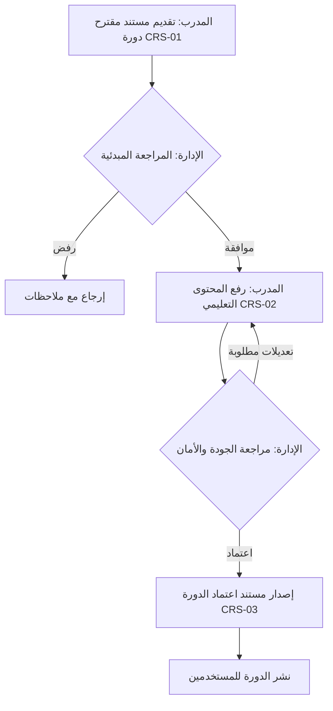
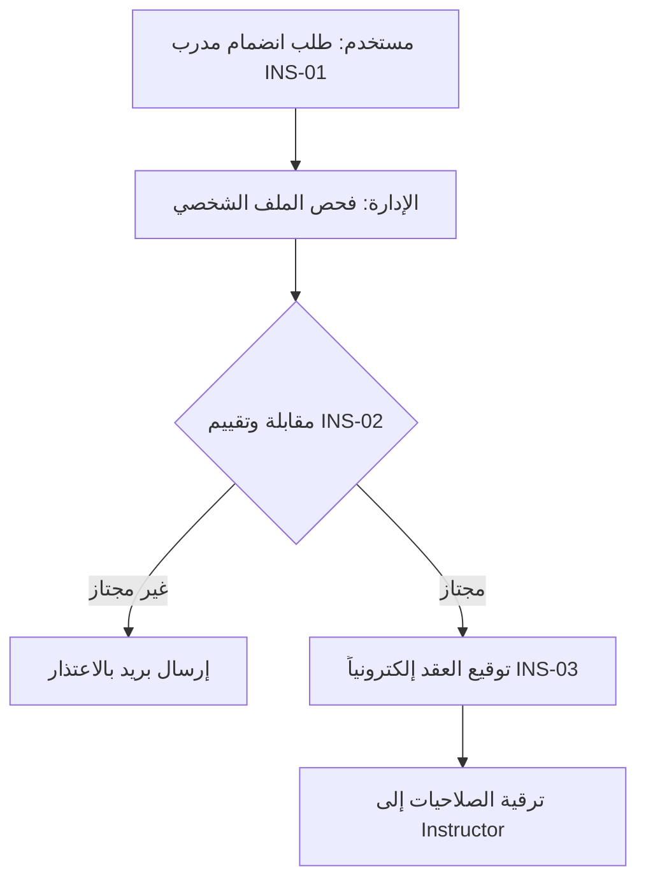

# 🎯 الدورة المستندية الشاملة لمنصة CyberShield Academy 🛡️

> [!NOTE]
> هذا المستند يمثل الهيكل التنظيمي والإداري الكامل لجميع العمليات والمستندات داخل منصة CyberShield Academy للأمن السيبراني، بما يضمن الشفافية، الجودة، وتتبع كافة العمليات.

## 👥 1. الأدوار والصلاحيات

| الدور (Role) | الوصف | الصلاحيات المستندية |
|---|---|---|
| **Student (طالب)** | المستخدم الأساسي للمنصة | تقديم طلبات الدعم، عرض الشهادات، تقارير الأداء الشخصية، نماذج التسجيل |
| **Instructor (مدرب)** | صانع المحتوى التعليمي | طلبات انضمام، إنشاء محتوى، تقارير تقييم الطلبة، اعتماد الدورات المبدئي |
| **Admin (مدير النظام)** | المسؤول التشغيلي | اعتماد دورات، إدارة مستخدمين، إدارة المدربين، إصدار شهادات، مراجعة تقارير النظام |
| **Security Admin** | المسؤول الأمني | مراجعة التقارير التقنية (Bugs/Vulnerabilities)، إدارة صلاحيات الوصول، تقارير الأداء |

---

## 📑 2. الدورة المستندية الأساسية

### 1️⃣ إدارة المستخدمين
* **`USR-01` مستند تسجيل مستخدم:** يسجل بيانات الطالب الأساسية وتاريخ الانضمام.
* **`USR-02` مستند تفعيل الحساب:** يوثق عملية التحقق (Email/2FA).
* **`USR-03` سجل نشاط المستخدم (Audit Log):** يوثق تسجيلات الدخول والخروج وعمليات تغيير كلمات المرور.

### 2️⃣ إدارة المدربين
* **`INS-01` طلب انضمام مدرب:** يوثق السيرة الذاتية، الشهادات، ومجال التخصص (Red Team/Blue Team/etc).
* **`INS-02` نموذج تقييم المدرب:** تقييم فني وإداري من قبل الإدارة.
* **`INS-03` عقد المدرب:** شروط الخدمة ونسبة الأرباح وتوقيع إلكتروني.

### 3️⃣ إدارة الدورات
* **`CRS-01` مستند مقترح دورة:** يحتوي على الفئة المستهدفة، المنهج (Syllabus)، ومخرجات التعلم.
* **`CRS-02` مستند رفع محتوى:** توثيق للملفات والفيديوهات المرفوعة.
* **`CRS-03` اعتماد الدورة:** تقرير مراجعة الجودة واعتماد النشر.

### 4️⃣ إدارة المختبرات (Labs)
* **`LAB-01` مستند إنشاء مختبر:** وصف بيئة الاختبار (VM/Docker)، الثغرة المستهدفة، والـ Flags.
* **`LAB-02` تقرير أداء المختبر:** استهلاك الموارد وحالة الخوادم.
* **`LAB-03` تقارير حل المختبرات للطلاب:** توثيق الخطوات التي اتبعها الطالب لحل التحدي.

### 5️⃣ إدارة الاختبارات
* **`EXM-01` مستند بنك الأسئلة:** اعتماد الأسئلة وربطها بمستويات الصعوبة.
* **`EXM-02` نتيجة اختبار:** تقرير مفصل بإجابات الطالب ودرجته النهائية.

### 6️⃣ إدارة الشهادات
* **`CRT-01` طلب إصدار شهادة:** يُنشأ تلقائياً عند إتمام الدورة أو الاختبار.
* **`CRT-02` سجل التحقق من الشهادة (Verification Log):** يوثق عمليات الاستعلام الخارجي عن صحة الشهادة باستخدام الـ QR Code.

### 7️⃣ إدارة العمليات التقنية
* **`TCH-01` تقرير ثغرة / خطأ (Bug Report):** وصف فني للخطأ البرمجي ومستوى الخطورة.
* **`TCH-02` طلب ميزة جديدة (Feature Request).**
* **`TCH-03` تقرير الأمان الدوري (Security Audit).**

---

## 🔄 3. تدفق العمليات (Workflows)

### 📌 تدفق اعتماد دورة جديدة

### 📌 تدفق انضمام مدرب

---

## 📝 4. النماذج (Forms Templates)

### 📄 نموذج طلب انضمام مدرب (`INS-01`)
> **رقم المستند:** [توليد تلقائي] | **التاريخ:** DD/MM/YYYY
> **اسم المتقدم:** _______________________
> **التخصص الدقيق:** [اختراق ويب / شبكات / هندسة عكسية / ...]
> **رابط LinkedIn:** _______________________
> **الشهادات المهنية (OSCP, CEH, etc):** _______________________
> 
> **الحالة:** [ ] قيد المراجعة  [ ] معتمد  [ ] مرفوض
> **توقيع مقدم الطلب:** __________________

### 📄 نموذج إنشاء دورة جديدة (`CRS-01`)
> **رقم المستند:** [توليد تلقائي] | **التاريخ:** DD/MM/YYYY
> **اسم المدرب:** _______________________
> **عنوان الدورة:** _______________________
> **المستوى:** [ ] مبتدئ  [ ] متوسط  [ ] متقدم
> **المتطلبات السابقة:** _______________________
> **مخرجات التعلم الأساسية:**
> 1. ___________ 2. ___________ 3. ___________
> 
> **اعتماد الإدارة:** __________________ (التوقيع الإلكتروني)

### 📄 تقرير خطأ تقني (`TCH-01`)
> **رقم التقرير:** [توليد تلقائي] | **التاريخ:** DD/MM/YYYY
> **المُبلغ:** _______________________
> **مستوى الخطورة:** [ ] Critical  [ ] High  [ ] Medium  [ ] Low
> **وصف المشكلة:** _______________________
> **خطوات إعادة الإنتاج (Steps to reproduce):** _______________________
> **حالة المعالجة:** [ ] Open  [ ] In Progress  [ ] Resolved

---

## 🗄️ 5. نظام الأرشفة والتصنيف

يعتمد نظام الأرشفة داخل المنصة على تخزين المستندات بصيغة JSON مقترنة بملفات PDF (عند الحاجة) داخل السحابة، ويتم التصنيف كالتالي:
* **حسب الكيان (Entity):** (مستخدمين `USR` - دورات `CRS` - مدربين `INS` - تقنية `TCH`).
* **حسب الحالة (Status):** مسودة (Draft) - نشط (Active) - مؤرشف (Archived) - ملغى (Revoked).
* **محرك البحث:** يتيح للمشرفين البحث برقم المستند، تاريخ الإنشاء، أو الكلمات المفتاحية.

---

## 📊 6. التقارير الدورية

1. **تقارير أداء المستخدمين:** نسب إتمام الدورات، معدلات نجاح المختبرات.
2. **تقارير مالية (للمدربين):** إجمالي مبيعات الدورات، نسب الأرباح، سجلات الدفع.
3. **تقارير الأمان (Security Logs):** محاولات الدخول الفاشلة، صلاحيات الوصول المعدلة، سجل الـ Audit Logs.

---

## 🔗 7. التكامل مع النظام الحالي (Integration Points)

> [!TIP]
> **التطبيق العملي في المنصة:** سيتم ربط هذه الدورة المستندية برمجياً مع قاعدة بيانات `Prisma` الحالية عبر الجداول التالية:

1. **نظام تسجيل الدخول والأمان:** سيتم ربط المستندات بجدول `User` لتحديد المُصدر والمُراجع باستخدام التوقيعات الإلكترونية المشفرة.
2. **قاعدة البيانات الحالية:** سيتم الاستفادة من `AuditLog` لتسجيل كل حركة تتم على أي مستند (إنشاء، تعديل، اعتماد).
3. **نظام الدورات (`Course`, `Lab`):** سيرتبط مستند `CRS-01` مباشرة عند محاولة المدرب إضافة دورة جديدة في واجهة المنصة.
4. **نظام الشهادات (`UserBadge`, `Progress`):** ربط الإصدار التلقائي للشهادات بجدول تقدم الطالب `UserProgress`.
